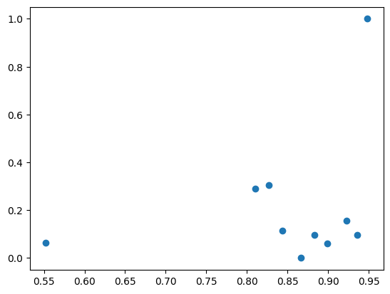

## Data Sizes in XLM-R Pretraining


### Data Sizes

The data sizes are taken from the paper on XLM-R (Conneau et. al) and the language groups are defined based on Ethnologue platform (https://www.ethnologue.com/).

```python
# Sizes in GB, from https://aclanthology.org/2020.acl-main.747.pdf

sizes_mb = {
	"mt": 0,
	"el": 46.9,
	"tr": 20.9,
	"sq": 5.4,
	"is": 3.2,
	"uk": 84.6,
	"ca": 10.1,
	"mk": 4.8,
	"hr": 20.5 +0.1 + 9.1, #added Bosnian, Serbian (in that order), 
	"sl": 10.3,
	}

sizes_mb_with_related = {
	"mt": 0 + 28.0, # Central Semitic Arabic languages (Afro-Asiatic language family): Maltese, Arabic
	"el": 46.9, # is a separate branch of Indo-European language family and has no direct descendants that could be added
	"tr": 20.9 + 6.5, # Southern Turkic (Turkic language family): Turkish, Azerbaijani
	"sq": 5.4, # is a separate branch of Indo-European language family and has no direct descendants that could be added
	"is": 3.2 + 45.6 + 49.0 + 12.1, # North Germanic languages: Icelandic, Danish, Norwegian, Swedish
	"uk": 84.6 + 4.3 + 278.0, #East Slavic: Ukrainian, Belarusian, Russian
	"ca": 10.1 + 53.3 + 2.9 + 49.1, # Ibero-Romance: Catalan, Spanish, Galician, Portuguese
	"mk": 4.8 + 57.5, # Eastern South Slavic: Macedonian, Bulgarian
	"hr": 20.5 + 0.1 + 9.1 + 10.3, # Western South Slavic languages: Croatian, Bosnian, Serbian, Slovenian (in that order)
	"sl": 10.3 + 20.5 + 0.1 + 9.1 # Western South Slavic languages: Slovenian, Croatian, Bosnian, Serbian (in that order)
	}

#Sizes in M of tokens.
sizes = {
	"mt": 0,
	"el": 4285, 
	"tr": 2736,
	"sq": 918,
	"is": 505,
	"uk": 6500,
	"ca": 1752,
	"mk": 449,
	"hr": 3297 + 14 + 843, #added Bosnian, Serbian (in that order), 
	"sl": 1669,}

sizes_with_related = {
	"mt": 0 + 2869, # Central Semitic Arabic languages (Afro-Asiatic language family): Maltese, Arabic
	"el": 4285, # is a separate branch of Indo-European language family and has no direct descendants that could be added
	"tr": 2736 + 783,
	"sq": 918, # is a separate branch of Indo-European language family and has no direct descendants that could be added
	"is": 505 + 7823 + 8494 + 778, # North Germanic languages: Icelandic, Danish, Norwegian, Swedish
	"uk": 6500 + 362 + 23408, # East Slavic: Ukrainian, Belarusian, Russian
	"ca": 1752 + 9374 + 495 + 8405, # Ibero-Romance: Catalan, Spanish, Galician, Portuguese
	"mk": 449 + 5487, # Eastern South Slavic: Macedonian, Bulgarian 
	"hr": 3297 + 1669 + 14 + 843, # Western South Slavic languages: Croatian, Slovenian, Bosnian, Serbian (in that order)
	"sl": 1669 + 3297 + 14 + 843 # Western South Slavic languages: Slovenian, Croatian, Bosnian, Serbian (in that order)
	}
```

Plot of Macro F1 (x-axis) performance and sizes in GB (y-axis), normalized with MinMax normalization:


Plot of Macro F1 (x-axis) performance and sizes (specific language + related languages) in GB (y-axis), normalized with MinMax normalization:



Correlations on dataset-level:

Sizes in tokens:

Pearsons correlation: 0.483
p-value: 0.15770106280572002
Spearmans correlation: 0.442
p-value: 0.20042268671194224

Sizes in GB:

Pearsons correlation: 0.415
p-value: 0.23343624750296876
Spearmans correlation: 0.588
p-value: 0.07387770688865801

Sizes in tokens + related languages:

Pearsons correlation: 0.240
p-value: 0.5035757809014645
Spearmans correlation: 0.280
p-value: 0.433925839676929

Sizes in GB + related languages:

Pearsons correlation: 0.298
p-value: 0.40378781012771897
Spearmans correlation: 0.122
p-value: 0.7379379712336098

## Token overlap

We tokenised the X-GENRE classifier training set and the test sets with XLM-RoBERTa tokenizer (as the X-GENRE classifier is based on XLM-RoBERTa). For each text, we took only the first 512 tokens, since this is also the max sequence length that can be seen by the X-GENRE classifier. We removed the starting and ending token (s, \s).

Then we calculated the overlap of the datasets, where we counter each occurrence of the token from the test set in the training set. We also calculated how many of the words that overlap are non-short - are more than 1 character long.

| language | percentage | overlap_list | non_short | non_short_per |
|---:|---:|---:|---:|---:|
| mt | 0.817085 | ▁Angel, o, ▁Che, t, ,, ▁se, ▁j, kun, d, u, ▁p... | 23083 | 0.723628 |
| el | 0.161428 | asi, asi, ,, ,, ▁Re, ception, ., ▁driver, ▁es... | 1883 | 0.373389 |
| tr | 0.521502 | ▁A, L, ▁Der, s, i, ▁ve, ▁Beli, r, leme, ▁S, h... | 11141 | 0.722269 |
| sq | 0.605775 | ▁Blog, ▁“, U, ▁kam, ▁me, jet, .”, ▁Jer, ▁31, ... | 12459 | 0.768315 |
| is | 0.517575 | ▁[, is, ], ▁er, fi, ▁reg, ▁sett, ar, lag, sin... | 10915 | 0.711399 |
| uk | 0.156675 | ., ,, ,, ?, ▁-, ., ?, ▁-, ', ., ,, ., ▁, ▁(, ... | 1258 | 0.253476 |
| ca | 0.744881 | ▁P, à, gine, s, ▁En, nada, ▁Porto, ▁uns, ▁die... | 15657 | 0.763123 |
| mk | 0.145989 | ,, ▁T, CL, ,, ▁T, CL, :, ▁Alca, tel, ▁Mobile,... | 1270 | 0.314746 |
| hr | 0.821517 | ▁O, ▁proizvod, u, ▁Color, ▁Trans, ,, ▁za, ▁pa... | 17678 | 0.810620 |
| sl | 0.974289 | ▁Kita, jsko, ▁mesto, ▁duhov, ▁V, ▁Notranj, i,... | 21567 | 0.841935 |