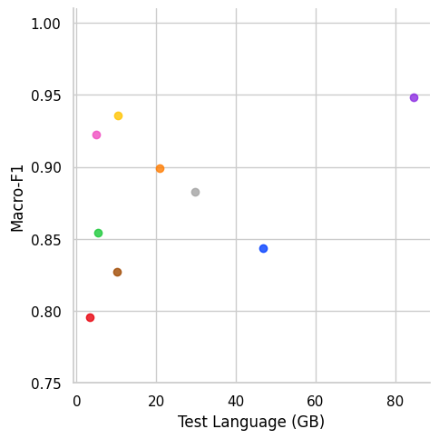
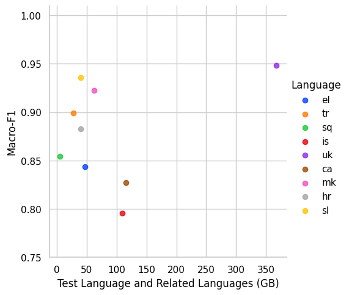
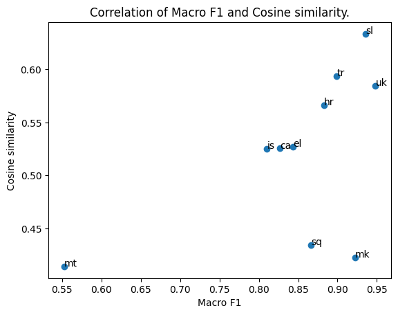

## Data Sizes in XLM-R Pretraining

### Data Sizes

The data sizes are taken from the paper on XLM-R (Conneau et. al) and the language groups are defined based on Ethnologue platform (https://www.ethnologue.com/).

```python
# Sizes in GB, from https://aclanthology.org/2020.acl-main.747.pdf

sizes_mb = {
	"mt": 0,
	"el": 46.9,
	"tr": 20.9,
	"sq": 5.4,
	"is": 3.2,
	"uk": 84.6,
	"ca": 10.1,
	"mk": 4.8,
	"hr": 20.5 +0.1 + 9.1, #added Bosnian, Serbian (in that order), 
	"sl": 10.3,
	}

sizes_mb_with_related = {
	"mt": 0 + 28.0, # Central Semitic Arabic languages (Afro-Asiatic language family): Maltese, Arabic
	"el": 46.9, # is a separate branch of Indo-European language family and has no direct descendants that could be added
	"tr": 20.9 + 6.5, # Southern Turkic (Turkic language family): Turkish, Azerbaijani
	"sq": 5.4, # is a separate branch of Indo-European language family and has no direct descendants that could be added
	"is": 3.2 + 45.6 + 49.0 + 12.1, # North Germanic languages: Icelandic, Danish, Norwegian, Swedish
	"uk": 84.6 + 4.3 + 278.0, #East Slavic: Ukrainian, Belarusian, Russian
	"ca": 10.1 + 53.3 + 2.9 + 49.1, # Ibero-Romance: Catalan, Spanish, Galician, Portuguese
	"mk": 4.8 + 57.5, # Eastern South Slavic: Macedonian, Bulgarian
	"hr": 20.5 + 0.1 + 9.1 + 10.3, # Western South Slavic languages: Croatian, Bosnian, Serbian, Slovenian (in that order)
	"sl": 10.3 + 20.5 + 0.1 + 9.1 # Western South Slavic languages: Slovenian, Croatian, Bosnian, Serbian (in that order)
	}

#Sizes in M of tokens.
sizes = {
	"mt": 0,
	"el": 4285, 
	"tr": 2736,
	"sq": 918,
	"is": 505,
	"uk": 6500,
	"ca": 1752,
	"mk": 449,
	"hr": 3297 + 14 + 843, #added Bosnian, Serbian (in that order), 
	"sl": 1669,}

sizes_with_related = {
	"mt": 0 + 2869, # Central Semitic Arabic languages (Afro-Asiatic language family): Maltese, Arabic
	"el": 4285, # is a separate branch of Indo-European language family and has no direct descendants that could be added
	"tr": 2736 + 783,
	"sq": 918, # is a separate branch of Indo-European language family and has no direct descendants that could be added
	"is": 505 + 7823 + 8494 + 778, # North Germanic languages: Icelandic, Danish, Norwegian, Swedish
	"uk": 6500 + 362 + 23408, # East Slavic: Ukrainian, Belarusian, Russian
	"ca": 1752 + 9374 + 495 + 8405, # Ibero-Romance: Catalan, Spanish, Galician, Portuguese
	"mk": 449 + 5487, # Eastern South Slavic: Macedonian, Bulgarian 
	"hr": 3297 + 1669 + 14 + 843, # Western South Slavic languages: Croatian, Slovenian, Bosnian, Serbian (in that order)
	"sl": 1669 + 3297 + 14 + 843 # Western South Slavic languages: Slovenian, Croatian, Bosnian, Serbian (in that order)
	}
```

Plot of Macro F1 (x-axis) performance and sizes in GB (y-axis):



Plot of Macro F1 (x-axis) performance and sizes (specific language + related languages) in GB (y-axis):




Correlation of Macro F1 scores and sizes in GB:

Pearsons correlation: 0.414
p-value: 0.23427547869351117
Spearmans correlation: 0.588
p-value: 0.07387770688865801

Correlation of Macro F1 scores and sizes in GB + related languages:

Pearsons correlation: 0.288
p-value: 0.41972254729183944
Spearmans correlation: 0.122
p-value: 0.7379379712336098

Correlations are not statistically significant.

## Token overlap

We tokenised the X-GENRE classifier training set and the test sets with XLM-RoBERTa tokenizer (as the X-GENRE classifier is based on XLM-RoBERTa). For each text, we took only the first 512 tokens, since this is also the max sequence length that can be seen by the X-GENRE classifier. We removed the starting and ending token (s, \s).

#### Corpus-level

We count all occurences of the tokens from the test set in the training set. The train dataset has 699.465 tokens and 27.025 unique words. The token count is saved at `datasets/tokenized_datasets/X-GENRE-train-token-count.json`.

Overlap percentage: percentage of all tokens from the test set that occur in the training set. Calculated in such manner that we counted all tokens from test set that do not appear in training set and divided by number of all tokens from the test set to get "no overlap" percentage, then calculated the overlap percentage by "1-no_overlap_percentage".

Statistics for number of all tokens and types (unique tokens) and overlapping tokens and types, and the overlap percentage:

|    |   overlap_percentage |   all_tokens |   overlapping_tokens |   all_types |   overlapping_types |
|:---|---------------------:|-------------:|---------------------:|------------:|--------------------:|
| sl |             0.974289 |        26292 |                25616 |        5763 |                5281 |
| hr |             0.821517 |        26546 |                21808 |        6222 |                4383 |
| mt |             0.802297 |        33697 |                27035 |        3874 |                2771 |
| ca |             0.744845 |        27544 |                20516 |        5314 |                2897 |
| sq |             0.60385  |        26596 |                16060 |        4871 |                2732 |
| tr |             0.520872 |        29681 |                15460 |        6231 |                2412 |
| is |             0.513003 |        29647 |                15209 |        4522 |                2017 |
| el |             0.161428 |        31240 |                 5043 |        4751 |                 822 |
| uk |             0.156658 |        31540 |                 4941 |        6463 |                 408 |
| mk |             0.145989 |        27639 |                 4035 |        5468 |                 656 |

Most frequent overlapping unique tokens in test sets:

|    | most_frequent_type                                                                                                                     |
|:---|:---------------------------------------------------------------------------------------------------------------------------------------|
| ca | [(',', 1079), ('▁de', 1013), ('.', 675), ('s', 651), ('▁i', 566), ('▁la', 560), ('▁a', 530), ('▁que', 439), ("'", 357), ('’', 334)]    |
| el | [('▁', 1017), ('.', 801), (',', 782), ('▁η', 159), ('▁"', 98), ('▁(', 83), (':', 62), (')', 60), ('"', 55), ('-', 45)]                 |
| hr | [(',', 878), ('.', 766), ('▁i', 546), ('▁u', 430), ('a', 413), ('▁je', 350), ('▁na', 282), ('▁za', 253), ('▁se', 239), ('e', 219)]     |
| is | [('.', 1021), ('▁og', 640), (',', 598), ('▁', 532), ('▁er', 357), ('s', 316), ('▁sem', 282), ('a', 272), ('i', 272), ('▁til', 261)]    |
| mk | [(',', 1021), ('.', 738), ('▁', 341), ('o', 126), ('e', 96), ('▁"', 85), (':', 64), ('"', 53), ('-', 47), ('▁-', 42)]                  |
| mt | [('-', 2014), (',', 800), ('▁', 679), ('.', 658), ('▁l', 490), ('a', 445), ('▁u', 414), ('i', 413), ("'", 399), ('▁li', 390)]          |
| sl | [(',', 1154), ('.', 805), ('▁je', 455), ('▁in', 443), ('▁v', 373), ('▁na', 317), ('▁za', 296), ('a', 240), ('▁se', 227), ('▁da', 214)] |
| sq | [(',', 800), ('▁e', 749), ('.', 642), ('▁me', 356), ('▁i', 311), ('t', 265), ('▁', 208), ('e', 204), ('▁te', 204), ('i', 200)]         |
| tr | [('.', 1008), (',', 818), ('▁ve', 438), ('▁bir', 264), ("'", 245), ('n', 212), ('▁', 190), ('m', 157), ('de', 146), ('i', 144)]        |
| uk | [(',', 1349), ('.', 1023), ('▁', 529), ('-', 132), ('▁–', 124), (':', 107), ('▁(', 88), ('▁«', 81), ('▁-', 74), ('i', 66)]             |

#### Label-level

We do the same as above, but separate all datasets according to genres, and calculate token overlap for each genre separatedly.

Number of tokens and types (unique tokens) in training dataset:

|                         |   token_count |   type_count |
|:------------------------|--------------:|-------------:|
| Information/Explanation |        124130 |        14678 |
| News                    |        136557 |        15319 |
| Instruction             |         83750 |         8929 |
| Opinion/Argumentation   |        103141 |        13088 |
| Forum                   |         58900 |         8555 |
| Prose/Lyrical           |         46860 |         5990 |
| Legal                   |         28496 |         4425 |
| Promotion               |         88626 |        12548 |


## Syntactic similarity - lang2vec

None of the results are statistically significant - see results in `calculate_corelation_coefficient.ipynb`.

# Adversarial analysis

Results on y_true and predictions on various variations of the same text - merged results for all languages (all test sets were merged into one dataframe) are in the table below.

The biggest changes in macro F1 scores are in the case of shuffling text (15 points less), removing structural markings (all words that contain digits + punctuation + lowercasing everything - 15 points less), removal of 50% of words (12 points less) and translation (into English - 10 points less).

In terms of genres, the following scenarios incur the highest decreases in F1 scores:
- News: shuffling (-18 points), removal of all words with capital letters (-12 points), punctuation removal (-11 points), translation (-11 points)

|                                                   |   macro_F1 |    News_F1 |   Opinion/Argumentation_F1 |   Instruction_F1 |   Information/Explanation_F1 |   Promotion_F1 |    Forum_F1 |   Prose/Lyrical_F1 |   Legal_F1 |
|:--------------------------------------------------|-----------:|-----------:|---------------------------:|-----------------:|-----------------------------:|---------------:|------------:|-------------------:|-----------:|
| y_pred                                            |  0.854108  |  0.868293  |                  0.77      |        0.846939  |                   0.77512    |     0.84058    |  0.877005   |         0.894472   |  0.960452  |
| translation-pred                                  |  0.751064  |  0.758893  |                  0.550265  |        0.826667  |                   0.74       |     0.693642   |  0.676471   |         0.875      |  0.887574  |
| translation-pred-vs-y_pred                        | **-0.103044**  | **-0.109399**  |                 **-0.219735**  |       -0.0202721 |                  -0.0351196  |    **-0.146938**   | **-0.200535**   |        -0.0194724  | -0.072878  |
| shuffled-text-pred                                |  0.70262   |  0.684492  |                  0.418301  |        0.64      |                   0.669643   |     0.756477   |  0.740741   |         0.845455   |  0.865854  |
| shuffled-text-pred-vs-y_pred                      | **-0.151487**  | **-0.183801**  |                 **-0.351699**  |       **-0.206939**  |                  **-0.105477**   |    -0.084103   | **-0.136265**   |        -0.0490178  | -0.0945983 |
| text_no_punct-pred                                |  0.756949  |  0.761905  |                  0.559006  |        0.743902  |                   0.721154   |     0.773585   |  0.74359    |         0.889952   |  0.8625    |
| text_no_punct-pred-vs-y_pred                      | -0.0971583 | **-0.106388**  |                 **-0.210994**  |       **-0.103036**  |                  -0.0539658  |    -0.0669948  | **-0.133416**   |        -0.00452021 | -0.097952  |
| text_no_capital-pred                              |  0.771149  |  0.75      |                  0.625     |        0.790698  |                   0.696833   |     0.779487   |  0.772093   |         0.837438   |  0.917647  |
| text_no_capital_rand-pred                         |  0.825031  |  0.805687  |                  0.732984  |        0.81768   |                   0.739336   |     0.820513   |  0.861878   |         0.904523   |  0.917647  |
| text_no_capital-pred-vs-y_pred                    | -0.0829581 | **-0.118293**  |                 **-0.145**     |       -0.0562411 |                  -0.078287   |    -0.0610925  | **-0.104912**   |        -0.0570339  | -0.0428049 |
| text_no_capital-pred-vs-text_no_capital_rand-pred | -0.0538816 | -0.0556872 |                 **-0.107984**  |       -0.0269819 |                  -0.0425039  |    -0.0410256  | -0.0897854  |        -0.0670842  |  0         |
| text_no_num-pred                                  |  0.818526  |  0.81448   |                  0.726368  |        0.793478  |                   0.753927   |     0.83       |  0.860465   |         0.871287   |  0.898204  |
| text_no_num_rand-pred                             |  0.836893  |  0.838095  |                  0.714286  |        0.822917  |                   0.78607    |     0.821782   |  0.871508   |         0.897959   |  0.942529  |
| text_no_num-pred-vs-y_pred                        | -0.0355815 | -0.053813  |                 -0.0436318 |       -0.0534605 |                  -0.0211929  |    -0.0105797  | -0.0165402  |        -0.0231852  | -0.0622484 |
| text_no_num-pred-vs-text_no_num_rand-pred         | -0.0183671 | -0.0236156 |                  0.0120824 |       -0.0294384 |                  -0.032143   |     0.00821782 | -0.0110433  |        -0.0266721  | -0.0443251 |
| text_no_structure-pred                            |  0.7015    |  0.708738  |                  0.560976  |        0.666667  |                   0.611111   |     0.727273   |  0.741935   |         0.805825   |  0.789474  |
| text_no_structure-pred-vs-y_pred                  | **-0.152608**  | **-0.159555**  |                 **-0.209024**  |       **-0.180272**  |                  **-0.164009**   |    **-0.113307**   | **-0.13507**    |        -0.0886471  | **-0.170978**  |
| text_no_structure-pred-vs-text_no_num_rand-pred   | **-0.135393**  | **-0.129357**  |                 **-0.15331**   |       **-0.15625**   |                  **-0.174959**   |    -0.0945095  | **-0.129573**   |        -0.0921339  | **-0.153055**  |
| text_random_removal_10-pred                       |  0.826225  |  0.807512  |                  0.720812  |        0.8       |                   0.766169   |     0.81       |  0.877778   |         0.903553   |  0.923977  |
| text_random_removal_10-pred-vs-y_pred             | -0.0278825 | -0.0607809 |                 -0.0491878 |       -0.0469388 |                  -0.00895046 |    -0.0305797  |  0.00077243 |         0.00908094 | -0.0364754 |
| text_random_removal_25-pred                       |  0.809962  |  0.790698  |                  0.685393  |        0.793103  |                   0.7343     |     0.84       |  0.860215   |         0.884422   |  0.891566  |
| text_random_removal_25-pred-vs-y_pred             | -0.0441454 | -0.077595  |                 -0.0846067 |       -0.0538353 |                  -0.0408201  |    -0.00057971 | -0.0167903  |        -0.0100503  | -0.0688857 |
| text_random_removal_50-pred                       |  0.737277  |  0.740741  |                  0.534091  |        0.6875    |                   0.702703   |     0.744898   |  0.768421   |         0.884422   |  0.835443  |
| text_random_removal_50-pred-vs-y_pred             | **-0.11683**   | **-0.127552**  |                 **-0.235909**  |       **-0.159439**  |                  -0.0724169  |    -0.0956818  | **-0.108584**   |        -0.0100503  | **-0.125009**  |

## Comparison between y_true and y_pred

If we compare predictions and true labels on the original texts, we can see that Forum is the label that is over-predicted the most (13% more), followed by Instruction (4% more) while Promotion and Information/Explanation are the most under-predicted (Information/Explanation - 9% less).

|                         |   proportion |   count_y_true |   count_y_pred |   change vs y_pred (%) |
|:------------------------|-------------:|---------------:|---------------:|-----------------------:|
| Information/Explanation |     0.137975 |            109 |            100 |                9       |
| Promotion               |     0.135443 |            107 |            100 |                7       |
| News                    |     0.132911 |            105 |            100 |                5       |
| Opinion/Argumentation   |     0.126582 |            100 |            100 |                0       |
| Prose/Lyrical           |     0.125316 |             99 |            100 |               -1       |
| Legal                   |     0.110127 |             87 |             90 |               -3.33333 |
| Instruction             |     0.121519 |             96 |            100 |               -4       |
| Forum                   |     0.110127 |             87 |            100 |              -13       |

## Comparison between predictions on original text and text, translated to English

We compare predictions on original texts and predictions on texts that were machine-translated to English. On English texts, much more texts are predicted to be "News" (almost 50% more) or "Instruction" than the predictions and true labels on original texts, while much less texts are predicted to be Promotion or Forum (almost 50% less).

|                         |   proportion |   count_translation-pred |   count_y_pred |   count_y_true |   change vs y_true (%) |   change vs y_pred (%) |
|:------------------------|-------------:|-------------------------:|---------------:|---------------:|-----------------------:|-----------------------:|
| News                    |   0.187342   |                      148 |            100 |            105 |               40.9524  |               48       |
| Instruction             |   0.163291   |                      129 |            100 |             96 |               34.375   |               29       |
| Prose/Lyrical           |   0.117722   |                       93 |            100 |             99 |               -6.06061 |               -7       |
| Legal                   |   0.103797   |                       82 |             90 |             87 |               -5.74713 |               -8.88889 |
| Information/Explanation |   0.11519    |                       91 |            100 |            109 |              -16.5138  |               -9       |
| Opinion/Argumentation   |   0.112658   |                       89 |            100 |            100 |              -11       |              -11       |
| Promotion               |   0.0835443  |                       66 |            100 |            107 |              -38.3178  |              -34       |
| Forum                   |   0.0620253  |                       49 |            100 |             87 |              -43.6782  |              -51       |
| Mix                     |   0.0493671  |                       39 |            nan |            nan |              nan       |              nan       |
| Other                   |   0.00506329 |                        4 |            nan |            nan |              nan       |              nan       |


## Comparison between original text and shuffled text

Here, we analyse the impact of removing all syntactic information by shuffling words - only semantic meaning of words remains. We do this in the following manner: we remove the symbols for next line("\n") and shuffle all the words in the text.

Here, many more texts are predicted to be Forum (up to a third) and Prose/Lyrical. This makes sense as in these genres, writers have more freedom in expression and can decide not to follow standard word order rules as strictly as with other genres. The genres which are now predicted much less are Instruction and Opinion/Argumentation. This also makes sense, as the syntax in these two genres is really important - in Instruction, text is organised in chronological steps that need to be followed, and in Opinion/Argumentation, the writer gradually develops his/her argumentation.

|                         |   proportion |   count_shuffled-text-pred |   count_y_pred |   count_y_true |   change vs y_true (%) |   change vs y_pred (%) |
|:------------------------|-------------:|---------------------------:|---------------:|---------------:|-----------------------:|-----------------------:|
| Forum                   |    0.163291  |                        129 |            100 |             87 |               48.2759  |                29      |
| Prose/Lyrical           |    0.153165  |                        121 |            100 |             99 |               22.2222  |                21      |
| Information/Explanation |    0.14557   |                        115 |            100 |            109 |                5.50459 |                15      |
| Promotion               |    0.108861  |                         86 |            100 |            107 |              -19.6262  |               -14      |
| Legal                   |    0.0974684 |                         77 |             90 |             87 |              -11.4943  |               -14.4444 |
| News                    |    0.103797  |                         82 |            100 |            105 |              -21.9048  |               -18      |
| Instruction             |    0.0683544 |                         54 |            100 |             96 |              -43.75    |               -46      |
| Opinion/Argumentation   |    0.0670886 |                         53 |            100 |            100 |              -47       |               -47      |
| Mix                     |    0.0810127 |                         64 |            nan |            nan |              nan       |               nan      |
| Other                   |    0.0113924 |                          9 |            nan |            nan |              nan       |               nan      |


## Comparison between original text and text with removed punctuation

Here we analyse the impact on the predictions of the removal of punctuations which mark text structure. We remove the symbol for new line "\n" and the following punctuation: [",", ".", "!", "?", ":", "'",  ";", '"', "”", "“", " - ", " – "]. We keep the punctuation that can occur inside words (I'm, two-thirds).

When we remove punctuation, much more texts are predicted to be News (up to a third), and much less texts are predicted to be Forum, Instruction or Opinion/Argumentation (30-40%).

|                         |   proportion |   count_text_no_punct-pred |   count_y_pred |   count_y_true |   change vs y_true (%) |   change vs y_pred (%) |
|:------------------------|-------------:|---------------------------:|---------------:|---------------:|-----------------------:|-----------------------:|
| News                    |    0.159494  |                        126 |            100 |            105 |               20       |                26      |
| Prose/Lyrical           |    0.139241  |                        110 |            100 |             99 |               11.1111  |                10      |
| Promotion               |    0.132911  |                        105 |            100 |            107 |               -1.86916 |                 5      |
| Information/Explanation |    0.125316  |                         99 |            100 |            109 |               -9.17431 |                -1      |
| Legal                   |    0.0924051 |                         73 |             90 |             87 |              -16.092   |               -18.8889 |
| Forum                   |    0.0873418 |                         69 |            100 |             87 |              -20.6897  |               -31      |
| Instruction             |    0.0860759 |                         68 |            100 |             96 |              -29.1667  |               -32      |
| Opinion/Argumentation   |    0.0772152 |                         61 |            100 |            100 |              -39       |               -39      |
| Mix                     |    0.0848101 |                         67 |            nan |            nan |              nan       |               nan      |
| Other                   |    0.0151899 |                         12 |            nan |            nan |              nan       |               nan      |


## Comparison between original text and text with randomly removed words

Here we analyse what is the impact if we increasingly remove words - we remove 10%, 25% and 50% of words (in random fashion) from each text, and compare the predictions with the original text. We do this by calculating length of each text so obtain the number of words to be removed and then at randomly remove words until we reach this number.

### Removal of 10% of words

There is a slight increase of texts that are predicted to be News (8%) and slight decrease of texts predicted to be Instruction (11%) if we compare the numbers of predictions with the distribution of predictions on original text. If we compare the results with the y_true, the biggest change can be observed with the Information/Explanation label (15% decrease).


|                         |   proportion |   count_text_random_removal_10-pred |   count_y_pred |   count_y_true |   change vs y_true (%) |   change vs y_pred (%) |
|:------------------------|-------------:|------------------------------------:|---------------:|---------------:|-----------------------:|-----------------------:|
| News                    |   0.136709   |                                 108 |            100 |            105 |                2.85714 |                8       |
| Prose/Lyrical           |   0.124051   |                                  98 |            100 |             99 |               -1.0101  |               -2       |
| Opinion/Argumentation   |   0.122785   |                                  97 |            100 |            100 |               -3       |               -3       |
| Legal                   |   0.106329   |                                  84 |             90 |             87 |               -3.44828 |               -6.66667 |
| Forum                   |   0.117722   |                                  93 |            100 |             87 |                6.89655 |               -7       |
| Promotion               |   0.117722   |                                  93 |            100 |            107 |              -13.0841  |               -7       |
| Information/Explanation |   0.116456   |                                  92 |            100 |            109 |              -15.5963  |               -8       |
| Instruction             |   0.112658   |                                  89 |            100 |             96 |               -7.29167 |              -11       |
| Mix                     |   0.0417722  |                                  33 |            nan |            nan |              nan       |              nan       |
| Other                   |   0.00379747 |                                   3 |            nan |            nan |              nan       |              nan       |

### Removal of 25% of words

The results are similar as with the removal of 10% of words. Interestingly, now, there is a rather big decrease of texts that are predicted to be Opinion/Argumentation or Instruction (around 20%). If we compare with the distribution of y_true, there is an increase of 13% of texts that are predicted to be Forum which makes sense, as these texts can be written in non-standard language and can have some parts of the sentences missing. In contrast, there is a decrease of texts predicted to be Information/Explanation and Promotion.

|                         |   proportion |   count_text_random_removal_25-pred |   count_y_pred |   count_y_true |   change vs y_true (%) |   change vs y_pred (%) |
|:------------------------|-------------:|------------------------------------:|---------------:|---------------:|-----------------------:|-----------------------:|
| News                    |   0.139241   |                                 110 |            100 |            105 |                 4.7619 |                10      |
| Prose/Lyrical           |   0.126582   |                                 100 |            100 |             99 |                 1.0101 |                 0      |
| Forum                   |   0.125316   |                                  99 |            100 |             87 |                13.7931 |                -1      |
| Information/Explanation |   0.124051   |                                  98 |            100 |            109 |               -10.0917 |                -2      |
| Promotion               |   0.117722   |                                  93 |            100 |            107 |               -13.0841 |                -7      |
| Legal                   |   0.1        |                                  79 |             90 |             87 |                -9.1954 |               -12.2222 |
| Instruction             |   0.0987342  |                                  78 |            100 |             96 |               -18.75   |               -22      |
| Opinion/Argumentation   |   0.0987342  |                                  78 |            100 |            100 |               -22      |               -22      |
| Mix                     |   0.0620253  |                                  49 |            nan |            nan |               nan      |               nan      |
| Other                   |   0.00759494 |                                   6 |            nan |            nan |               nan      |               nan      |

### Removal of 50% of words

If we remove 50% of words, there is a big decrease of text predicted to be Instruction (36% less), Opinion/Argumentation and Legal (around 20% less). If we compare the results with the y_pred, there is a large increase of texts predicted to be Forum (which isn't shown if we compare the distribution of y_pred.)

|                         |   proportion |   count_text_random_removal_50-pred |   count_y_pred |   count_y_true |   change vs y_true (%) |   change vs y_pred (%) |
|:------------------------|-------------:|------------------------------------:|---------------:|---------------:|-----------------------:|-----------------------:|
| Information/Explanation |    0.143038  |                                 113 |            100 |            109 |                3.66972 |                13      |
| News                    |    0.140506  |                                 111 |            100 |            105 |                5.71429 |                11      |
| Forum                   |    0.13038   |                                 103 |            100 |             87 |               18.3908  |                 3      |
| Prose/Lyrical           |    0.126582  |                                 100 |            100 |             99 |                1.0101  |                 0      |
| Promotion               |    0.112658  |                                  89 |            100 |            107 |              -16.8224  |               -11      |
| Legal                   |    0.0898734 |                                  71 |             90 |             87 |              -18.3908  |               -21.1111 |
| Opinion/Argumentation   |    0.0962025 |                                  76 |            100 |            100 |              -24       |               -24      |
| Instruction             |    0.0810127 |                                  64 |            100 |             96 |              -33.3333  |               -36      |
| Mix                     |    0.0696203 |                                  55 |            nan |            nan |              nan       |               nan      |
| Other                   |    0.0101266 |                                   8 |            nan |            nan |              nan       |               nan      |


## Comparison between original text with randomly removed words and text where all word with capitalized letters are removed

Here we investigate what is the impact of removing all words that have capitalized letters in them. Since this also changes text length, we do not compare the results with the results of the original texts, but for each text also randomly remove the same amount of words as were removed due to being capitalized, to compare the results with the results of the texts with randomly removed same number of words.

Interestingly, there is no change in Promotion and Legal. If we remove all words that have capitalized letters (and we compare the predictions with the predictions to texts where the same number of random words were removed), much more text are predicted to be Forum (36%). This makes sense, since people on Forums use non-standard language and often do not use capitalization. At the same time, much less texts are predicted to be News (25% less) which also makes sense, as News are often focused on people and places (which are capitalized).

|                         |   proportion |   count_text_no_capital-pred |   count_no_capital_rand |   count_y_true |   change vs y_true (%) |   change vs no_capital_rand (%) |
|:------------------------|-------------:|-----------------------------:|------------------------:|---------------:|-----------------------:|--------------------------------:|
| Forum                   |   0.162025   |                          128 |                      94 |             87 |               47.1264  |                        36.1702  |
| Information/Explanation |   0.141772   |                          112 |                     102 |            109 |                2.75229 |                         9.80392 |
| Mix                     |   0.0518987  |                           41 |                      38 |            nan |              nan       |                         7.89474 |
| Prose/Lyrical           |   0.131646   |                          104 |                     100 |             99 |                5.05051 |                         4       |
| Promotion               |   0.111392   |                           88 |                      88 |            107 |              -17.757   |                         0       |
| Legal                   |   0.105063   |                           83 |                      83 |             87 |               -4.5977  |                         0       |
| Other                   |   0.00379747 |                            3 |                       3 |            nan |              nan       |                         0       |
| Instruction             |   0.0962025  |                           76 |                      85 |             96 |              -20.8333  |                       -10.5882  |
| Opinion/Argumentation   |   0.0962025  |                           76 |                      91 |            100 |              -24       |                       -16.4835  |
| News                    |   0.1        |                           79 |                     106 |            105 |              -24.7619  |                       -25.4717  |

## Comparison between original text with randomly removed words and texts with removed numbers

Here we analyse the impact of removing words that contain one or more digits. As with the impact of removing capitalized words, we also prepare texts that have the same number of words removed, but choosing random words to remove, and compare the results of this sample with the results of texts with removed numbers.

Interestingly, when we remove numbers, but also when we remove random words, more texts were predicted to be "Mix". There is also a slight increase (10%) in prediction of News, and slight decrease in prediction of Information/Explanation, Instruction, Legal and Forum, but the numbers are not large in any direction.

|                         |   proportion |   count_text_no_num-pred |   count_no_num_rand |   count_y_true |   change vs y_true (%) |   change vs no_num_rand (%) |
|:------------------------|-------------:|-------------------------:|--------------------:|---------------:|-----------------------:|----------------------------:|
| Mix                     |   0.0506329  |                       40 |                  28 |            nan |              nan       |                    42.8571  |
| News                    |   0.146835   |                      116 |                 105 |            105 |               10.4762  |                    10.4762  |
| Prose/Lyrical           |   0.13038    |                      103 |                  97 |             99 |                4.0404  |                     6.18557 |
| Opinion/Argumentation   |   0.127848   |                      101 |                  96 |            100 |                1       |                     5.20833 |
| Other                   |   0.00253165 |                        2 |                   2 |            nan |              nan       |                     0       |
| Promotion               |   0.117722   |                       93 |                  95 |            107 |              -13.0841  |                    -2.10526 |
| Forum                   |   0.107595   |                       85 |                  92 |             87 |               -2.29885 |                    -7.6087  |
| Legal                   |   0.101266   |                       80 |                  87 |             87 |               -8.04598 |                    -8.04598 |
| Instruction             |   0.111392   |                       88 |                  96 |             96 |               -8.33333 |                    -8.33333 |
| Information/Explanation |   0.103797   |                       82 |                  92 |            109 |              -24.7706  |                   -10.8696  |

## Comparison between original text with removed structural information and texts with removed numbers

Here, we start from the text with removed numbers and go further with removal of structural information: we also remove punctuation and lowercase all letters. We then compare the results with the results of the sample with randomly removed words (same number of words removed as the number of removed numbers in the other sample).

Interestingly, as we remove numbers, punctuation and lowercase words, there is a large amount of texts that are now predicted as "Other" or "Mix". Promotion, Prose/Lyrical and Forum are now more frequently predicted (Promotion - 30% more), while Information/Explanation, Legal, Opinion/Argumentation and Instruction are predicted significantly less often, with the Instruction predicted almost 45% less often.

|                         |   proportion |   count_text_no_structure-pred |   count_no_num_rand |   count_y_true |   change vs y_true (%) |   change vs no_num_rand (%) |
|:------------------------|-------------:|-------------------------------:|--------------------:|---------------:|-----------------------:|----------------------------:|
| Other                   |    0.0151899 |                             12 |                   2 |            nan |              nan       |                   500       |
| Mix                     |    0.117722  |                             93 |                  28 |            nan |              nan       |                   232.143   |
| Promotion               |    0.156962  |                            124 |                  95 |            107 |               15.8879  |                    30.5263  |
| Prose/Lyrical           |    0.135443  |                            107 |                  97 |             99 |                8.08081 |                    10.3093  |
| Forum                   |    0.125316  |                             99 |                  92 |             87 |               13.7931  |                     7.6087  |
| News                    |    0.127848  |                            101 |                 105 |            105 |               -3.80952 |                    -3.80952 |
| Information/Explanation |    0.0898734 |                             71 |                  92 |            109 |              -34.8624  |                   -22.8261  |
| Legal                   |    0.0822785 |                             65 |                  87 |             87 |              -25.2874  |                   -25.2874  |
| Opinion/Argumentation   |    0.0810127 |                             64 |                  96 |            100 |              -36       |                   -33.3333  |
| Instruction             |    0.0683544 |                             54 |                  96 |             96 |              -43.75    |                   -43.75    |


# Results from old data (not cleaned)

Here are the results of the experiments performed on the old data -- where English and other non-target language paragraphs were not removed yet. I did not do these evaluations on the new, cleaned data, as I won't include these test to the final paper.

## Corelation of genre frequency

Pearson and Spearman correlation for genre frequency for all corpora

According to p-value in Pearson correlation, higher than 0.05:

|                                       |   Pearson |   Pearson-p-value |   Spearman |   Spearman-p-value |
|:--------------------------------------|----------:|------------------:|-----------:|-------------------:|
| News-Information/Explanation          | -0.875348 |       4.11861e-05 |  -0.806593 |        0.000491113 |
| News-Forum                            | -0.707912 |       0.00461391  |  -0.564835 |        0.0353302   |
| Prose/Lyrical-Instruction             | -0.658999 |       0.0103677   |  -0.336264 |        0.239792    |
| News-Prose/Lyrical                    | -0.642166 |       0.0132784   |  -0.213187 |        0.464303    |
| News-Opinion/Argumentation            | -0.587845 |       0.0270476   |  -0.516484 |        0.0586372   |
| Prose/Lyrical-Promotion               | -0.583297 |       0.028556    |  -0.389011 |        0.169217    |
| Forum-Information/Explanation         |  0.538151 |       0.047128    |   0.217582 |        0.454919    |
| Forum-Opinion/Argumentation           |  0.566594 |       0.0346383   |   0.476923 |        0.0846484   |
| Forum-Prose/Lyrical                   |  0.622027 |       0.0175389   |   0.340659 |        0.233316    |
| Instruction-Promotion                 |  0.6428   |       0.0131586   |   0.63956  |        0.0137796   |
| Promotion-Legal                       |  0.705183 |       0.00484659  |   0.696703 |        0.00562868  |
| Information/Explanation-Prose/Lyrical |  0.827685 |       0.000257882 |   0.138462 |        0.636885    |

Correlations with p-value < 0.05 according to Spearman correlation:

|                              |   Pearson |   Pearson-p-value |   Spearman |   Spearman-p-value |
|:-----------------------------|----------:|------------------:|-----------:|-------------------:|
| News-Information/Explanation | -0.875348 |       4.11861e-05 |  -0.806593 |        0.000491113 |
| News-Forum                   | -0.707912 |       0.00461391  |  -0.564835 |        0.0353302   |
| Instruction-Promotion        |  0.6428   |       0.0131586   |   0.63956  |        0.0137796   |
| Legal-Promotion              |  0.705183 |       0.00484659  |   0.696703 |        0.00562868  |

## Token overlap, calculated on normalized and transliterated texts

We transliterated Cyrillic and Greek script to Latin using [cyrtranslit](https://github.com/opendatakosovo/cyrillic-transliteration) and [transliterate](https://pypi.org/project/transliterate/) Python libraries. Then we also lowercased all texts and normalized all language-specific characters using the [unidecode](https://pypi.org/project/Unidecode/).

The idea of analysing normalized token overlap is in this that by transliterating all characters to Latin, we get closer to what is the semantic overlap (tokens representing units that carry meaning).

|    |   percentage |   overlap_list_size |   overlap_set_size |
|:---|-------------:|--------------------:|-------------------:|
| sl |     0.983558 |               26320 |               4485 |
| mt |     0.908776 |               35146 |               3691 |
| mk |     0.905123 |               27704 |               3293 |
| uk |     0.900191 |               31991 |               2957 |
| el |     0.895228 |               29231 |               2567 |
| hr |     0.873856 |               23588 |               3917 |
| ca |     0.810781 |               22290 |               2666 |
| is |     0.809069 |               24586 |               2447 |
| sq |     0.779926 |               21175 |               2597 |
| tr |     0.729727 |               22623 |               2468 |

## Based on cosine similarity

Another idea: we calculate cosine similarity of vectors of token distributions, comparing token distribution of train dataset with test set. For each test set, we create a list of token types that appear either in train dataset or test set. Then we create vectors of occurrences of these token types in 1) train dataset, and 2) test set. We calculate cosine similarity between these two vectors. Results:

|    |   cosine_similarity |   vector_size |
|:---|--------------------:|--------------:|
| sl |            0.633451 |         27507 |
| tr |            0.593847 |         30846 |
| uk |            0.584612 |         33121 |
| hr |            0.56621  |         28864 |
| el |            0.527321 |         30954 |
| ca |            0.525439 |         29443 |
| is |            0.525135 |         29518 |
| sq |            0.434489 |         29168 |
| mk |            0.422532 |         31837 |
| mt |            0.414248 |         28226 |

Correlation with Macro F1 (corpus level):

Pearsons correlation: 0.560
p-value: 0.0926047843840466
Spearmans correlation: 0.624
p-value: 0.053717767217167395


