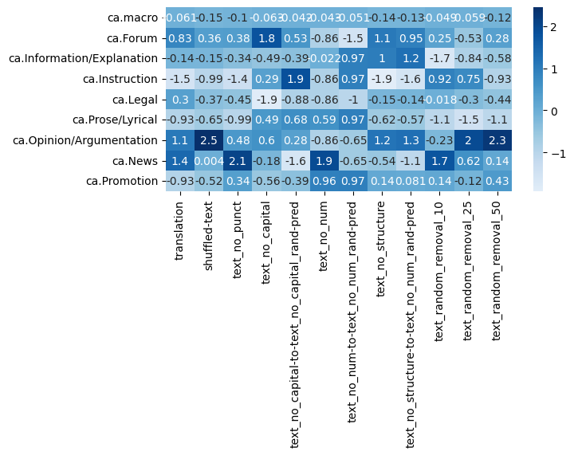
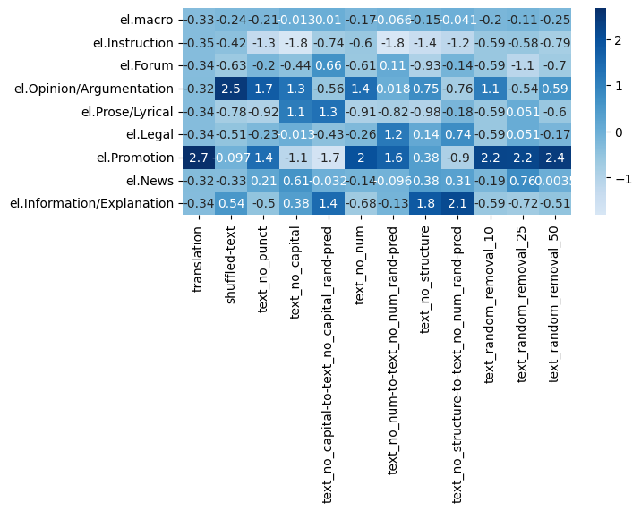
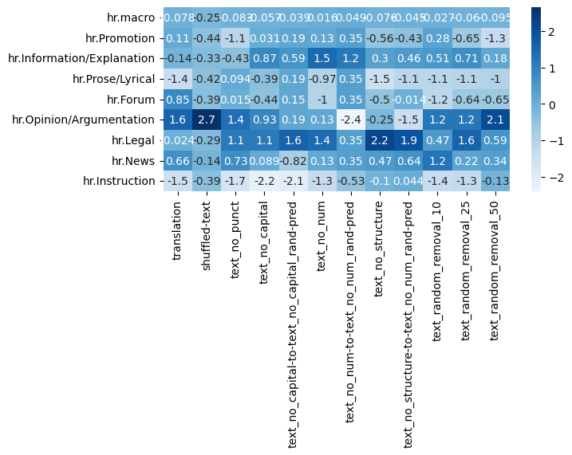
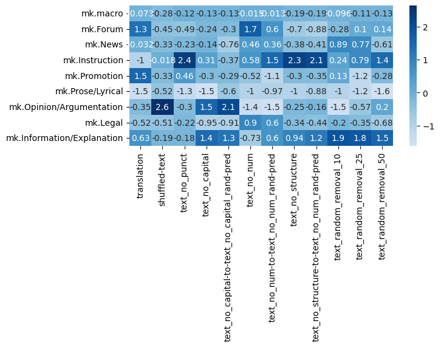
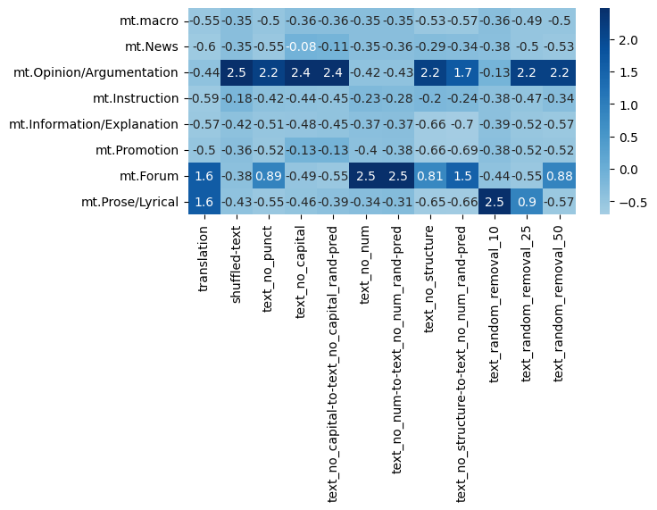
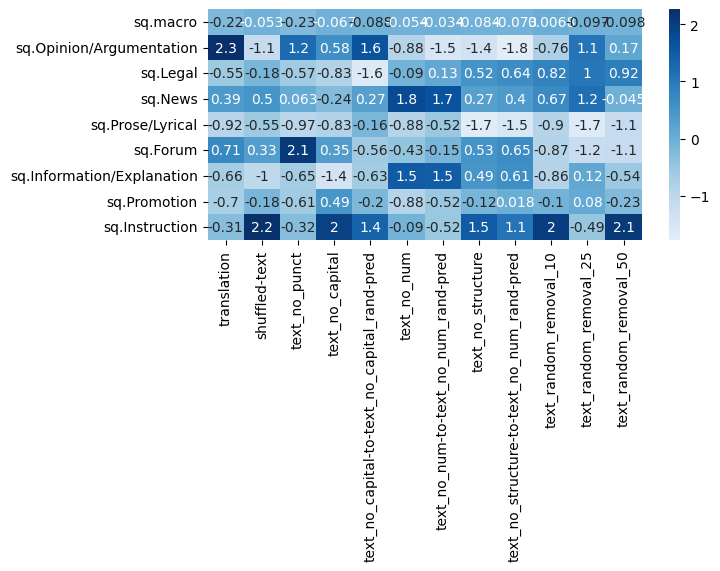
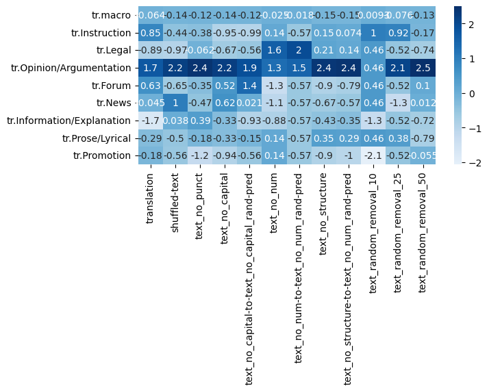

## Data Sizes in XLM-R Pretraining

### Data Sizes

The data sizes are taken from the paper on XLM-R (Conneau et. al) and the language groups are defined based on Ethnologue platform (https://www.ethnologue.com/).

```python
# Sizes in GB, from https://aclanthology.org/2020.acl-main.747.pdf

sizes_mb = {
	"mt": 0,
	"el": 46.9,
	"tr": 20.9,
	"sq": 5.4,
	"is": 3.2,
	"uk": 84.6,
	"ca": 10.1,
	"mk": 4.8,
	"hr": 20.5 +0.1 + 9.1, #added Bosnian, Serbian (in that order), 
	"sl": 10.3,
	}

sizes_mb_with_related = {
	"mt": 0 + 28.0, # Central Semitic Arabic languages (Afro-Asiatic language family): Maltese, Arabic
	"el": 46.9, # is a separate branch of Indo-European language family and has no direct descendants that could be added
	"tr": 20.9 + 6.5, # Southern Turkic (Turkic language family): Turkish, Azerbaijani
	"sq": 5.4, # is a separate branch of Indo-European language family and has no direct descendants that could be added
	"is": 3.2 + 45.6 + 49.0 + 12.1, # North Germanic languages: Icelandic, Danish, Norwegian, Swedish
	"uk": 84.6 + 4.3 + 278.0, #East Slavic: Ukrainian, Belarusian, Russian
	"ca": 10.1 + 53.3 + 2.9 + 49.1, # Ibero-Romance: Catalan, Spanish, Galician, Portuguese
	"mk": 4.8 + 57.5, # Eastern South Slavic: Macedonian, Bulgarian
	"hr": 20.5 + 0.1 + 9.1 + 10.3, # Western South Slavic languages: Croatian, Bosnian, Serbian, Slovenian (in that order)
	"sl": 10.3 + 20.5 + 0.1 + 9.1 # Western South Slavic languages: Slovenian, Croatian, Bosnian, Serbian (in that order)
	}

#Sizes in M of tokens.
sizes = {
	"mt": 0,
	"el": 4285, 
	"tr": 2736,
	"sq": 918,
	"is": 505,
	"uk": 6500,
	"ca": 1752,
	"mk": 449,
	"hr": 3297 + 14 + 843, #added Bosnian, Serbian (in that order), 
	"sl": 1669,}

sizes_with_related = {
	"mt": 0 + 2869, # Central Semitic Arabic languages (Afro-Asiatic language family): Maltese, Arabic
	"el": 4285, # is a separate branch of Indo-European language family and has no direct descendants that could be added
	"tr": 2736 + 783,
	"sq": 918, # is a separate branch of Indo-European language family and has no direct descendants that could be added
	"is": 505 + 7823 + 8494 + 778, # North Germanic languages: Icelandic, Danish, Norwegian, Swedish
	"uk": 6500 + 362 + 23408, # East Slavic: Ukrainian, Belarusian, Russian
	"ca": 1752 + 9374 + 495 + 8405, # Ibero-Romance: Catalan, Spanish, Galician, Portuguese
	"mk": 449 + 5487, # Eastern South Slavic: Macedonian, Bulgarian 
	"hr": 3297 + 1669 + 14 + 843, # Western South Slavic languages: Croatian, Slovenian, Bosnian, Serbian (in that order)
	"sl": 1669 + 3297 + 14 + 843 # Western South Slavic languages: Slovenian, Croatian, Bosnian, Serbian (in that order)
	}
```

Plot of Macro F1 (x-axis) performance and sizes in GB (y-axis):


Plot of Macro F1 (x-axis) performance and sizes (specific language + related languages) in GB (y-axis):


Correlation of Macro F1 scores and sizes in GB:

Pearsons correlation: 0.414
p-value: 0.23427547869351117
Spearmans correlation: 0.588
p-value: 0.07387770688865801

Correlation of Macro F1 scores and sizes in GB + related languages:

Pearsons correlation: 0.288
p-value: 0.41972254729183944
Spearmans correlation: 0.122
p-value: 0.7379379712336098

Correlations are not statistically significant.

## Token overlap

We tokenised the X-GENRE classifier training set and the test sets with XLM-RoBERTa tokenizer (as the X-GENRE classifier is based on XLM-RoBERTa). For each text, we took only the first 512 tokens, since this is also the max sequence length that can be seen by the X-GENRE classifier. We removed the starting and ending token (s, \s).

#### Corpus-level

We count all occurences of the tokens from the test set in the training set. The train dataset has 699.465 tokens and 27.025 unique words. The token count is saved at `datasets/tokenized_datasets/X-GENRE-train-token-count.json`.

Overlap percentage: percentage of all tokens from the test set that occur in the training set. Calculated in such manner that we counted all tokens from test set that do not appear in training set and divided by number of all tokens from the test set to get "no overlap" percentage, then calculated the overlap percentage by "1-no_overlap_percentage".

Statistics for number of all tokens and types (unique tokens) and overlapping tokens and types, and the overlap percentage:

|    |   overlap_percentage |   all_tokens |   overlapping_tokens |   all_types |   overlapping_types |
|:---|---------------------:|-------------:|---------------------:|------------:|--------------------:|
| sl |             0.974289 |        26292 |                25616 |        5763 |                5281 |
| hr |             0.821517 |        26546 |                21808 |        6222 |                4383 |
| mt |             0.802297 |        33697 |                27035 |        3874 |                2771 |
| ca |             0.744845 |        27544 |                20516 |        5314 |                2897 |
| sq |             0.60385  |        26596 |                16060 |        4871 |                2732 |
| tr |             0.520872 |        29681 |                15460 |        6231 |                2412 |
| is |             0.513003 |        29647 |                15209 |        4522 |                2017 |
| el |             0.161428 |        31240 |                 5043 |        4751 |                 822 |
| uk |             0.156658 |        31540 |                 4941 |        6463 |                 408 |
| mk |             0.145989 |        27639 |                 4035 |        5468 |                 656 |

Most frequent overlapping unique tokens in test sets:

|    | most_frequent_type                                                                                                                     |
|:---|:---------------------------------------------------------------------------------------------------------------------------------------|
| ca | [(',', 1079), ('▁de', 1013), ('.', 675), ('s', 651), ('▁i', 566), ('▁la', 560), ('▁a', 530), ('▁que', 439), ("'", 357), ('’', 334)]    |
| el | [('▁', 1017), ('.', 801), (',', 782), ('▁η', 159), ('▁"', 98), ('▁(', 83), (':', 62), (')', 60), ('"', 55), ('-', 45)]                 |
| hr | [(',', 878), ('.', 766), ('▁i', 546), ('▁u', 430), ('a', 413), ('▁je', 350), ('▁na', 282), ('▁za', 253), ('▁se', 239), ('e', 219)]     |
| is | [('.', 1021), ('▁og', 640), (',', 598), ('▁', 532), ('▁er', 357), ('s', 316), ('▁sem', 282), ('a', 272), ('i', 272), ('▁til', 261)]    |
| mk | [(',', 1021), ('.', 738), ('▁', 341), ('o', 126), ('e', 96), ('▁"', 85), (':', 64), ('"', 53), ('-', 47), ('▁-', 42)]                  |
| mt | [('-', 2014), (',', 800), ('▁', 679), ('.', 658), ('▁l', 490), ('a', 445), ('▁u', 414), ('i', 413), ("'", 399), ('▁li', 390)]          |
| sl | [(',', 1154), ('.', 805), ('▁je', 455), ('▁in', 443), ('▁v', 373), ('▁na', 317), ('▁za', 296), ('a', 240), ('▁se', 227), ('▁da', 214)] |
| sq | [(',', 800), ('▁e', 749), ('.', 642), ('▁me', 356), ('▁i', 311), ('t', 265), ('▁', 208), ('e', 204), ('▁te', 204), ('i', 200)]         |
| tr | [('.', 1008), (',', 818), ('▁ve', 438), ('▁bir', 264), ("'", 245), ('n', 212), ('▁', 190), ('m', 157), ('de', 146), ('i', 144)]        |
| uk | [(',', 1349), ('.', 1023), ('▁', 529), ('-', 132), ('▁–', 124), (':', 107), ('▁(', 88), ('▁«', 81), ('▁-', 74), ('i', 66)]             |

#### Label-level

We do the same as above, but separate all datasets according to genres, and calculate token overlap for each genre separatedly.

Number of tokens and types (unique tokens) in training dataset:

|                         |   token_count |   type_count |
|:------------------------|--------------:|-------------:|
| Information/Explanation |        124130 |        14678 |
| News                    |        136557 |        15319 |
| Instruction             |         83750 |         8929 |
| Opinion/Argumentation   |        103141 |        13088 |
| Forum                   |         58900 |         8555 |
| Prose/Lyrical           |         46860 |         5990 |
| Legal                   |         28496 |         4425 |
| Promotion               |         88626 |        12548 |


## Syntactic similarity - lang2vec

None of the results are statistically significant - see results in `calculate_corelation_coefficient.ipynb`.

# Adversarial analysis

Results on y_true and predictions on various variations of the same text - merged results for all languages (all test sets were merged into one dataframe) are in the table below.

The biggest changes in macro F1 scores are in the case of shuffling text (15 points less), removing structural markings (all words that contain digits + punctuation + lowercasing everything - 15 points less), removal of 50% of words (12 points less) and translation (into English - 10 points less).

In terms of genres, the following scenarios incur the highest decreases in F1 scores:
- News: shuffling (-18 points), structural markings removal (-16 points), removal of 50% of words (-13 points), removal of all words with capital letters (-12 points), punctuation removal (-11 points), translation (-11 points)
- Opinion/Argumentation: shuffling (-35 points), removal of 50% of words (-24 points), translation (-22 points), structural markings removal (-21 points), punctuation removal (-21 points), removal of all words with capital letters (-15 points)
- Instruction: shuffling (-21 points), structural markings removal (-18 points), removal of 50% of words (-16 points), punctuation removal (-10 points)
- Information/Explanation: structural markings removal (-16 points), shuffling (-11 points)
- Promotion: translation (-15 points), structural markings removal (-11 points)
- Forum: translation (-20 points), shuffling (-14 points), structural markings removal (-14 points), punctuation removal (-13 points), 50% of words removal (-11 points), capital letters removal (-10 points)
- Prose/Lyrical: no change incurred a drop in more than 10 points, highest drop: removal of structural markings (-9 points)
- Legal: removal of structural markings (-17 points), removal of 50% of words (-13 points)

|                                                   |   macro_F1 |    News_F1 |   Opinion/Argumentation_F1 |   Instruction_F1 |   Information/Explanation_F1 |   Promotion_F1 |    Forum_F1 |   Prose/Lyrical_F1 |   Legal_F1 |
|:--------------------------------------------------|-----------:|-----------:|---------------------------:|-----------------:|-----------------------------:|---------------:|------------:|-------------------:|-----------:|
| y_pred                                            |  0.854108  |  0.868293  |                  0.77      |        0.846939  |                   0.77512    |     0.84058    |  0.877005   |         0.894472   |  0.960452  |
| translation-pred                                  |  0.751064  |  0.758893  |                  0.550265  |        0.826667  |                   0.74       |     0.693642   |  0.676471   |         0.875      |  0.887574  |
| translation-pred-vs-y_pred                        | **-0.103044**  | **-0.109399**  |                 **-0.219735**  |       -0.0202721 |                  -0.0351196  |    **-0.146938**   | **-0.200535**   |        -0.0194724  | -0.072878  |
| shuffled-text-pred                                |  0.70262   |  0.684492  |                  0.418301  |        0.64      |                   0.669643   |     0.756477   |  0.740741   |         0.845455   |  0.865854  |
| shuffled-text-pred-vs-y_pred                      | **-0.151487**  | **-0.183801**  |                 **-0.351699**  |       **-0.206939**  |                  **-0.105477**   |    -0.084103   | **-0.136265**   |        -0.0490178  | -0.0945983 |
| text_no_punct-pred                                |  0.756949  |  0.761905  |                  0.559006  |        0.743902  |                   0.721154   |     0.773585   |  0.74359    |         0.889952   |  0.8625    |
| text_no_punct-pred-vs-y_pred                      | -0.0971583 | **-0.106388**  |                 **-0.210994**  |       **-0.103036**  |                  -0.0539658  |    -0.0669948  | **-0.133416**   |        -0.00452021 | -0.097952  |
| text_no_capital-pred                              |  0.771149  |  0.75      |                  0.625     |        0.790698  |                   0.696833   |     0.779487   |  0.772093   |         0.837438   |  0.917647  |
| text_no_capital_rand-pred                         |  0.825031  |  0.805687  |                  0.732984  |        0.81768   |                   0.739336   |     0.820513   |  0.861878   |         0.904523   |  0.917647  |
| text_no_capital-pred-vs-y_pred                    | -0.0829581 | **-0.118293**  |                 **-0.145**     |       -0.0562411 |                  -0.078287   |    -0.0610925  | **-0.104912**   |        -0.0570339  | -0.0428049 |
| text_no_capital-pred-vs-text_no_capital_rand-pred | -0.0538816 | -0.0556872 |                 **-0.107984**  |       -0.0269819 |                  -0.0425039  |    -0.0410256  | -0.0897854  |        -0.0670842  |  0         |
| text_no_num-pred                                  |  0.818526  |  0.81448   |                  0.726368  |        0.793478  |                   0.753927   |     0.83       |  0.860465   |         0.871287   |  0.898204  |
| text_no_num_rand-pred                             |  0.836893  |  0.838095  |                  0.714286  |        0.822917  |                   0.78607    |     0.821782   |  0.871508   |         0.897959   |  0.942529  |
| text_no_num-pred-vs-y_pred                        | -0.0355815 | -0.053813  |                 -0.0436318 |       -0.0534605 |                  -0.0211929  |    -0.0105797  | -0.0165402  |        -0.0231852  | -0.0622484 |
| text_no_num-pred-vs-text_no_num_rand-pred         | -0.0183671 | -0.0236156 |                  0.0120824 |       -0.0294384 |                  -0.032143   |     0.00821782 | -0.0110433  |        -0.0266721  | -0.0443251 |
| text_no_structure-pred                            |  0.7015    |  0.708738  |                  0.560976  |        0.666667  |                   0.611111   |     0.727273   |  0.741935   |         0.805825   |  0.789474  |
| text_no_structure-pred-vs-y_pred                  | **-0.152608**  | **-0.159555**  |                 **-0.209024**  |       **-0.180272**  |                  **-0.164009**   |    **-0.113307**   | **-0.13507**    |        -0.0886471  | **-0.170978**  |
| text_no_structure-pred-vs-text_no_num_rand-pred   | **-0.135393**  | **-0.129357**  |                 **-0.15331**   |       **-0.15625**   |                  **-0.174959**   |    -0.0945095  | **-0.129573**   |        -0.0921339  | **-0.153055**  |
| text_random_removal_10-pred                       |  0.826225  |  0.807512  |                  0.720812  |        0.8       |                   0.766169   |     0.81       |  0.877778   |         0.903553   |  0.923977  |
| text_random_removal_10-pred-vs-y_pred             | -0.0278825 | -0.0607809 |                 -0.0491878 |       -0.0469388 |                  -0.00895046 |    -0.0305797  |  0.00077243 |         0.00908094 | -0.0364754 |
| text_random_removal_25-pred                       |  0.809962  |  0.790698  |                  0.685393  |        0.793103  |                   0.7343     |     0.84       |  0.860215   |         0.884422   |  0.891566  |
| text_random_removal_25-pred-vs-y_pred             | -0.0441454 | -0.077595  |                 -0.0846067 |       -0.0538353 |                  -0.0408201  |    -0.00057971 | -0.0167903  |        -0.0100503  | -0.0688857 |
| text_random_removal_50-pred                       |  0.737277  |  0.740741  |                  0.534091  |        0.6875    |                   0.702703   |     0.744898   |  0.768421   |         0.884422   |  0.835443  |
| text_random_removal_50-pred-vs-y_pred             | **-0.11683**   | **-0.127552**  |                 **-0.235909**  |       **-0.159439**  |                  -0.0724169  |    -0.0956818  | **-0.108584**   |        -0.0100503  | **-0.125009**  |

Analysis of the impact of adversarial attacks based on the macro F1 scores for each language - the attacks with the highest impact:
- MT: removal of structural markings (-32 points),  word with capital letters removal (-31 points), shuffling word order (-21 points), removal of 50% of words (-20 points), punctuation removal (-18 points), removal of 10% of words (-10 points), removal of 25% of words (-14 points)
- EL: shuffling (-21 points), translation (-18 points), punctuation removal (-15 points), removal of structural markings (-12 points), removal of 50% of words (-12 points), number removal (-11 points)
- TR: removal of 50% of words (-13 points), shuffling (-11 points), removal of structural markings (-10 points)
- SQ: removal of 50% of words (-15 points), punctuation removal (-13 points), shuffling (-12 points), removal of structural markings (-12 points), translation (-11 points)
- IS: translation (-15 points)
- UK: shuffling (-24 points), removal of structural markings (-21 points), translation (-17 points), removal of 50% of words (-15 points), punctuation removal (-12 points)
- CA: none of the interventions led to 10 or more points decrease. Biggest impact: shuffling, removal of structural markings, removal of 50% of words (9 points)
- MK: removal of structural markings (-26 points), shuffling (-25 points), removal of 50% of words (-18 points), removal of punctuation (-16 points), translation (-15 points), removal of words with capitalized letters (-13 points)
- HR: shuffling (-12 points), removal of structural markings (-10 points), removal of 50% of words (-10 points)
- SL: removal of structural markings (-22 points), translation (-16 points), shuffling (-14 points), punctuation removal (-13 points), removal of 50% of words (-11 points)

|                                                   |         mt |           el |          tr |          sq |          is |          uk |         ca |         mk |          hr |          sl |
|:--------------------------------------------------|-----------:|-------------:|------------:|------------:|------------:|------------:|-----------:|-----------:|------------:|------------:|
| y_pred                                            |  0.488408  |  0.84356     |  0.899063   |  0.854073   |  0.795338   |  0.948327   |  0.827101  |  0.922638  |  0.882916   |  0.935625   |
| translation-pred                                  |  0.422156  |  0.667432    |  0.810064   |  0.742894   |  0.643434   |  0.774705   |  0.760178  |  0.772557  |  0.789453   |  0.778775   |
| translation-pred-vs-y_pred                        | -0.0662513 | **-0.176128**    | -0.0889991  | **-0.111179**   | **-0.151904**   | **-0.173623**   | -0.066923  | **-0.150081**  | -0.0934629  | **-0.15685**    |
| shuffled-text-pred                                |  0.282766  |  0.634038    |  0.784729   |  0.72975    |  0.718404   |  0.711248   |  0.73436   |  0.669621  |  0.759024   |  0.799215   |
| shuffled-text-pred-vs-y_pred                      | **-0.205641**  | **-0.209522**    | **-0.114334**   | **-0.124323**   | -0.0769341  | **-0.237079**   | -0.0927409 | **-0.253017**  | **-0.123892**   | **-0.13641**    |
| text_no_punct-pred                                |  0.31244   |  0.690398    |  0.857738   |  0.724246   |  0.762613   |  0.831048   |  0.742799  |  0.764548  |  0.843166   |  0.80134    |
| text_no_punct-pred-vs-y_pred                      | **-0.175968**  | **-0.153162**    | -0.0413251  | **-0.129827**   | -0.0327255  | **-0.117279**   | -0.0843022 | **-0.15809**   | -0.03975    | **-0.134285**   |
| text_no_capital-pred                              |  0.17063   |  0.843606    |  0.823153   |  0.796639   |  0.728155   |  0.860035   |  0.748809  |  0.793859  |  0.891885   |  0.875271   |
| text_no_capital_rand-pred                         |  0.391458  |  0.787623    |  0.874779   |  0.852999   |  0.771304   |  0.932738   |  0.782302  |  0.885162  |  0.873639   |  0.913574   |
| text_no_capital-pred-vs-y_pred                    | **-0.317778**  |  4.63248e-05 | -0.0759105  | -0.0574338  | -0.0671835  | -0.0882921  | -0.0782924 | **-0.128779**  |  0.008969   | -0.0603541  |
| text_no_capital-pred-vs-text_no_capital_rand-pred | **-0.220828**  |  0.055983    | -0.0516269  | -0.0563605  | -0.0431493  | -0.072703   | -0.0334938 | -0.0913025 |  0.0182457  | -0.0383027  |
| text_no_num-pred                                  |  0.391186  |  0.738104    |  0.904728   |  0.799112   |  0.80763    |  0.938276   |  0.799811  |  0.855417  |  0.887325   |  0.891845   |
| text_no_num_rand-pred                             |  0.447375  |  0.773042    |  0.915753   |  0.838429   |  0.796652   |  0.944855   |  0.774592  |  0.896935  |  0.868526   |  0.94092    |
| text_no_num-pred-vs-y_pred                        | -0.0972216 | **-0.105456**    |  0.00566442 | -0.0549608  |  0.0122919  | -0.0100512  | -0.0272899 | -0.0672206 |  0.00440943 | -0.0437799  |
| text_no_num-pred-vs-text_no_num_rand-pred         | -0.0561888 | -0.0349377   | -0.0110256  | -0.0393175  |  0.0109785  | -0.00657895 |  0.0252193 | -0.0415177 |  0.0187996  | -0.0490744  |
| text_no_structure-pred                            |  0.155462  |  0.719132    |  0.798306   |  0.733799   |  0.785274   |  0.737303   |  0.733405  |  0.664989  |  0.781763   |  0.711017   |
| text_no_structure-pred-vs-y_pred                  | **-0.332945**  | **-0.124428**    | **-0.100757**   | **-0.120274**   | -0.0100638  | **-0.211024**   | -0.0936961 | **-0.257649**  | **-0.101153**   | **-0.224608**   |
| text_no_structure-pred-vs-text_no_num_rand-pred   | **-0.291913**  | -0.0539099   | **-0.117447**   | **-0.104631**   | -0.0113771  | **-0.207552**   | -0.0411869 | **-0.231946**  | -0.0867627  | **-0.229903**   |
| text_random_removal_10-pred                       |  0.386164  |  0.768054    |  0.908369   |  0.847583   |  0.790168   |  0.939444   |  0.777462  |  0.854036  |  0.862531   |  0.916005   |
| text_random_removal_10-pred-vs-y_pred             | **-0.102244**  | -0.0755064   |  0.0093063  | -0.00648941 | -0.00517007 | -0.00888348 | -0.0496389 | -0.0686019 | -0.0203847  | -0.0196201  |
| text_random_removal_25-pred                       |  0.349852  |  0.761652    |  0.874136   |  0.756209   |  0.796429   |  0.935534   |  0.766287  |  0.840788  |  0.866256   |  0.927762   |
| text_random_removal_25-pred-vs-y_pred             | **-0.138556**  | -0.0819085   | -0.0249268  | -0.0978635  |  0.00109032 | -0.0127931  | -0.060814  | -0.0818496 | -0.0166594  | -0.00786341 |
| text_random_removal_50-pred                       |  0.292631  |  0.719467    |  0.772016   |  0.705111   |  0.75178    |  0.801742   |  0.734581  |  0.743159  |  0.781509   |  0.827121   |
| text_random_removal_50-pred-vs-y_pred             | **-0.195777**  | **-0.124093**    | **-0.127047**   | **-0.148961**   | -0.0435584  | **-0.146586**   | -0.0925202 | **-0.179479**  | **-0.101407**   | **-0.108505**   |

## Calculations of relative errors for each language (heatmaps)


















## Comparison between y_true and y_pred

If we compare predictions and true labels on the original texts, we can see that Forum is the label that is over-predicted the most (13% more), followed by Instruction (4% more) while Promotion and Information/Explanation are the most under-predicted (Information/Explanation - 9% less).

|                         |   proportion |   count_y_true |   count_y_pred |   change vs y_pred (%) |
|:------------------------|-------------:|---------------:|---------------:|-----------------------:|
| Information/Explanation |     0.137975 |            109 |            100 |                9       |
| Promotion               |     0.135443 |            107 |            100 |                7       |
| News                    |     0.132911 |            105 |            100 |                5       |
| Opinion/Argumentation   |     0.126582 |            100 |            100 |                0       |
| Prose/Lyrical           |     0.125316 |             99 |            100 |               -1       |
| Legal                   |     0.110127 |             87 |             90 |               -3.33333 |
| Instruction             |     0.121519 |             96 |            100 |               -4       |
| Forum                   |     0.110127 |             87 |            100 |              -13       |

## Comparison between predictions on original text and text, translated to English

We compare predictions on original texts and predictions on texts that were machine-translated to English. On English texts, much more texts are predicted to be "News" (almost 50% more) or "Instruction" than the predictions and true labels on original texts, while much less texts are predicted to be Promotion or Forum (almost 50% less).

|                         |   proportion |   count_translation-pred |   count_y_pred |   count_y_true |   change vs y_true (%) |   change vs y_pred (%) |
|:------------------------|-------------:|-------------------------:|---------------:|---------------:|-----------------------:|-----------------------:|
| News                    |   0.187342   |                      148 |            100 |            105 |               40.9524  |               48       |
| Instruction             |   0.163291   |                      129 |            100 |             96 |               34.375   |               29       |
| Prose/Lyrical           |   0.117722   |                       93 |            100 |             99 |               -6.06061 |               -7       |
| Legal                   |   0.103797   |                       82 |             90 |             87 |               -5.74713 |               -8.88889 |
| Information/Explanation |   0.11519    |                       91 |            100 |            109 |              -16.5138  |               -9       |
| Opinion/Argumentation   |   0.112658   |                       89 |            100 |            100 |              -11       |              -11       |
| Promotion               |   0.0835443  |                       66 |            100 |            107 |              -38.3178  |              -34       |
| Forum                   |   0.0620253  |                       49 |            100 |             87 |              -43.6782  |              -51       |
| Mix                     |   0.0493671  |                       39 |            nan |            nan |              nan       |              nan       |
| Other                   |   0.00506329 |                        4 |            nan |            nan |              nan       |              nan       |


## Comparison between original text and shuffled text

Here, we analyse the impact of removing all syntactic information by shuffling words - only semantic meaning of words remains. We do this in the following manner: we remove the symbols for next line("\n") and shuffle all the words in the text.

Here, many more texts are predicted to be Forum (up to a third) and Prose/Lyrical. This makes sense as in these genres, writers have more freedom in expression and can decide not to follow standard word order rules as strictly as with other genres. The genres which are now predicted much less are Instruction and Opinion/Argumentation. This also makes sense, as the syntax in these two genres is really important - in Instruction, text is organised in chronological steps that need to be followed, and in Opinion/Argumentation, the writer gradually develops his/her argumentation.

|                         |   proportion |   count_shuffled-text-pred |   count_y_pred |   count_y_true |   change vs y_true (%) |   change vs y_pred (%) |
|:------------------------|-------------:|---------------------------:|---------------:|---------------:|-----------------------:|-----------------------:|
| Forum                   |    0.163291  |                        129 |            100 |             87 |               48.2759  |                29      |
| Prose/Lyrical           |    0.153165  |                        121 |            100 |             99 |               22.2222  |                21      |
| Information/Explanation |    0.14557   |                        115 |            100 |            109 |                5.50459 |                15      |
| Promotion               |    0.108861  |                         86 |            100 |            107 |              -19.6262  |               -14      |
| Legal                   |    0.0974684 |                         77 |             90 |             87 |              -11.4943  |               -14.4444 |
| News                    |    0.103797  |                         82 |            100 |            105 |              -21.9048  |               -18      |
| Instruction             |    0.0683544 |                         54 |            100 |             96 |              -43.75    |               -46      |
| Opinion/Argumentation   |    0.0670886 |                         53 |            100 |            100 |              -47       |               -47      |
| Mix                     |    0.0810127 |                         64 |            nan |            nan |              nan       |               nan      |
| Other                   |    0.0113924 |                          9 |            nan |            nan |              nan       |               nan      |


## Comparison between original text and text with removed punctuation

Here we analyse the impact on the predictions of the removal of punctuations which mark text structure. We remove the symbol for new line "\n" and the following punctuation: [",", ".", "!", "?", ":", "'",  ";", '"', "”", "“", " - ", " – "]. We keep the punctuation that can occur inside words (I'm, two-thirds).

When we remove punctuation, much more texts are predicted to be News (up to a third), and much less texts are predicted to be Forum, Instruction or Opinion/Argumentation (30-40%).

|                         |   proportion |   count_text_no_punct-pred |   count_y_pred |   count_y_true |   change vs y_true (%) |   change vs y_pred (%) |
|:------------------------|-------------:|---------------------------:|---------------:|---------------:|-----------------------:|-----------------------:|
| News                    |    0.159494  |                        126 |            100 |            105 |               20       |                26      |
| Prose/Lyrical           |    0.139241  |                        110 |            100 |             99 |               11.1111  |                10      |
| Promotion               |    0.132911  |                        105 |            100 |            107 |               -1.86916 |                 5      |
| Information/Explanation |    0.125316  |                         99 |            100 |            109 |               -9.17431 |                -1      |
| Legal                   |    0.0924051 |                         73 |             90 |             87 |              -16.092   |               -18.8889 |
| Forum                   |    0.0873418 |                         69 |            100 |             87 |              -20.6897  |               -31      |
| Instruction             |    0.0860759 |                         68 |            100 |             96 |              -29.1667  |               -32      |
| Opinion/Argumentation   |    0.0772152 |                         61 |            100 |            100 |              -39       |               -39      |
| Mix                     |    0.0848101 |                         67 |            nan |            nan |              nan       |               nan      |
| Other                   |    0.0151899 |                         12 |            nan |            nan |              nan       |               nan      |


## Comparison between original text and text with randomly removed words

Here we analyse what is the impact if we increasingly remove words - we remove 10%, 25% and 50% of words (in random fashion) from each text, and compare the predictions with the original text. We do this by calculating length of each text so obtain the number of words to be removed and then at randomly remove words until we reach this number.

### Removal of 10% of words

There is a slight increase of texts that are predicted to be News (8%) and slight decrease of texts predicted to be Instruction (11%) if we compare the numbers of predictions with the distribution of predictions on original text. If we compare the results with the y_true, the biggest change can be observed with the Information/Explanation label (15% decrease).


|                         |   proportion |   count_text_random_removal_10-pred |   count_y_pred |   count_y_true |   change vs y_true (%) |   change vs y_pred (%) |
|:------------------------|-------------:|------------------------------------:|---------------:|---------------:|-----------------------:|-----------------------:|
| News                    |   0.136709   |                                 108 |            100 |            105 |                2.85714 |                8       |
| Prose/Lyrical           |   0.124051   |                                  98 |            100 |             99 |               -1.0101  |               -2       |
| Opinion/Argumentation   |   0.122785   |                                  97 |            100 |            100 |               -3       |               -3       |
| Legal                   |   0.106329   |                                  84 |             90 |             87 |               -3.44828 |               -6.66667 |
| Forum                   |   0.117722   |                                  93 |            100 |             87 |                6.89655 |               -7       |
| Promotion               |   0.117722   |                                  93 |            100 |            107 |              -13.0841  |               -7       |
| Information/Explanation |   0.116456   |                                  92 |            100 |            109 |              -15.5963  |               -8       |
| Instruction             |   0.112658   |                                  89 |            100 |             96 |               -7.29167 |              -11       |
| Mix                     |   0.0417722  |                                  33 |            nan |            nan |              nan       |              nan       |
| Other                   |   0.00379747 |                                   3 |            nan |            nan |              nan       |              nan       |

### Removal of 25% of words

The results are similar as with the removal of 10% of words. Interestingly, now, there is a rather big decrease of texts that are predicted to be Opinion/Argumentation or Instruction (around 20%). If we compare with the distribution of y_true, there is an increase of 13% of texts that are predicted to be Forum which makes sense, as these texts can be written in non-standard language and can have some parts of the sentences missing. In contrast, there is a decrease of texts predicted to be Information/Explanation and Promotion.

|                         |   proportion |   count_text_random_removal_25-pred |   count_y_pred |   count_y_true |   change vs y_true (%) |   change vs y_pred (%) |
|:------------------------|-------------:|------------------------------------:|---------------:|---------------:|-----------------------:|-----------------------:|
| News                    |   0.139241   |                                 110 |            100 |            105 |                 4.7619 |                10      |
| Prose/Lyrical           |   0.126582   |                                 100 |            100 |             99 |                 1.0101 |                 0      |
| Forum                   |   0.125316   |                                  99 |            100 |             87 |                13.7931 |                -1      |
| Information/Explanation |   0.124051   |                                  98 |            100 |            109 |               -10.0917 |                -2      |
| Promotion               |   0.117722   |                                  93 |            100 |            107 |               -13.0841 |                -7      |
| Legal                   |   0.1        |                                  79 |             90 |             87 |                -9.1954 |               -12.2222 |
| Instruction             |   0.0987342  |                                  78 |            100 |             96 |               -18.75   |               -22      |
| Opinion/Argumentation   |   0.0987342  |                                  78 |            100 |            100 |               -22      |               -22      |
| Mix                     |   0.0620253  |                                  49 |            nan |            nan |               nan      |               nan      |
| Other                   |   0.00759494 |                                   6 |            nan |            nan |               nan      |               nan      |

### Removal of 50% of words

If we remove 50% of words, there is a big decrease of text predicted to be Instruction (36% less), Opinion/Argumentation and Legal (around 20% less). If we compare the results with the y_pred, there is a large increase of texts predicted to be Forum (which isn't shown if we compare the distribution of y_pred.)

|                         |   proportion |   count_text_random_removal_50-pred |   count_y_pred |   count_y_true |   change vs y_true (%) |   change vs y_pred (%) |
|:------------------------|-------------:|------------------------------------:|---------------:|---------------:|-----------------------:|-----------------------:|
| Information/Explanation |    0.143038  |                                 113 |            100 |            109 |                3.66972 |                13      |
| News                    |    0.140506  |                                 111 |            100 |            105 |                5.71429 |                11      |
| Forum                   |    0.13038   |                                 103 |            100 |             87 |               18.3908  |                 3      |
| Prose/Lyrical           |    0.126582  |                                 100 |            100 |             99 |                1.0101  |                 0      |
| Promotion               |    0.112658  |                                  89 |            100 |            107 |              -16.8224  |               -11      |
| Legal                   |    0.0898734 |                                  71 |             90 |             87 |              -18.3908  |               -21.1111 |
| Opinion/Argumentation   |    0.0962025 |                                  76 |            100 |            100 |              -24       |               -24      |
| Instruction             |    0.0810127 |                                  64 |            100 |             96 |              -33.3333  |               -36      |
| Mix                     |    0.0696203 |                                  55 |            nan |            nan |              nan       |               nan      |
| Other                   |    0.0101266 |                                   8 |            nan |            nan |              nan       |               nan      |


## Comparison between original text with randomly removed words and text where all word with capitalized letters are removed

Here we investigate what is the impact of removing all words that have capitalized letters in them. Since this also changes text length, we do not compare the results with the results of the original texts, but for each text also randomly remove the same amount of words as were removed due to being capitalized, to compare the results with the results of the texts with randomly removed same number of words.

Interestingly, there is no change in Promotion and Legal. If we remove all words that have capitalized letters (and we compare the predictions with the predictions to texts where the same number of random words were removed), much more text are predicted to be Forum (36%). This makes sense, since people on Forums use non-standard language and often do not use capitalization. At the same time, much less texts are predicted to be News (25% less) which also makes sense, as News are often focused on people and places (which are capitalized).

|                         |   proportion |   count_text_no_capital-pred |   count_no_capital_rand |   count_y_true |   change vs y_true (%) |   change vs no_capital_rand (%) |
|:------------------------|-------------:|-----------------------------:|------------------------:|---------------:|-----------------------:|--------------------------------:|
| Forum                   |   0.162025   |                          128 |                      94 |             87 |               47.1264  |                        36.1702  |
| Information/Explanation |   0.141772   |                          112 |                     102 |            109 |                2.75229 |                         9.80392 |
| Mix                     |   0.0518987  |                           41 |                      38 |            nan |              nan       |                         7.89474 |
| Prose/Lyrical           |   0.131646   |                          104 |                     100 |             99 |                5.05051 |                         4       |
| Promotion               |   0.111392   |                           88 |                      88 |            107 |              -17.757   |                         0       |
| Legal                   |   0.105063   |                           83 |                      83 |             87 |               -4.5977  |                         0       |
| Other                   |   0.00379747 |                            3 |                       3 |            nan |              nan       |                         0       |
| Instruction             |   0.0962025  |                           76 |                      85 |             96 |              -20.8333  |                       -10.5882  |
| Opinion/Argumentation   |   0.0962025  |                           76 |                      91 |            100 |              -24       |                       -16.4835  |
| News                    |   0.1        |                           79 |                     106 |            105 |              -24.7619  |                       -25.4717  |

## Comparison between original text with randomly removed words and texts with removed numbers

Here we analyse the impact of removing words that contain one or more digits. As with the impact of removing capitalized words, we also prepare texts that have the same number of words removed, but choosing random words to remove, and compare the results of this sample with the results of texts with removed numbers.

Interestingly, when we remove numbers, but also when we remove random words, more texts were predicted to be "Mix". There is also a slight increase (10%) in prediction of News, and slight decrease in prediction of Information/Explanation, Instruction, Legal and Forum, but the numbers are not large in any direction.

|                         |   proportion |   count_text_no_num-pred |   count_no_num_rand |   count_y_true |   change vs y_true (%) |   change vs no_num_rand (%) |
|:------------------------|-------------:|-------------------------:|--------------------:|---------------:|-----------------------:|----------------------------:|
| Mix                     |   0.0506329  |                       40 |                  28 |            nan |              nan       |                    42.8571  |
| News                    |   0.146835   |                      116 |                 105 |            105 |               10.4762  |                    10.4762  |
| Prose/Lyrical           |   0.13038    |                      103 |                  97 |             99 |                4.0404  |                     6.18557 |
| Opinion/Argumentation   |   0.127848   |                      101 |                  96 |            100 |                1       |                     5.20833 |
| Other                   |   0.00253165 |                        2 |                   2 |            nan |              nan       |                     0       |
| Promotion               |   0.117722   |                       93 |                  95 |            107 |              -13.0841  |                    -2.10526 |
| Forum                   |   0.107595   |                       85 |                  92 |             87 |               -2.29885 |                    -7.6087  |
| Legal                   |   0.101266   |                       80 |                  87 |             87 |               -8.04598 |                    -8.04598 |
| Instruction             |   0.111392   |                       88 |                  96 |             96 |               -8.33333 |                    -8.33333 |
| Information/Explanation |   0.103797   |                       82 |                  92 |            109 |              -24.7706  |                   -10.8696  |

## Comparison between original text with removed structural information and texts with removed numbers

Here, we start from the text with removed numbers and go further with removal of structural information: we also remove punctuation and lowercase all letters. We then compare the results with the results of the sample with randomly removed words (same number of words removed as the number of removed numbers in the other sample).

Interestingly, as we remove numbers, punctuation and lowercase words, there is a large amount of texts that are now predicted as "Other" or "Mix". Promotion, Prose/Lyrical and Forum are now more frequently predicted (Promotion - 30% more), while Information/Explanation, Legal, Opinion/Argumentation and Instruction are predicted significantly less often, with the Instruction predicted almost 45% less often.

|                         |   proportion |   count_text_no_structure-pred |   count_no_num_rand |   count_y_true |   change vs y_true (%) |   change vs no_num_rand (%) |
|:------------------------|-------------:|-------------------------------:|--------------------:|---------------:|-----------------------:|----------------------------:|
| Other                   |    0.0151899 |                             12 |                   2 |            nan |              nan       |                   500       |
| Mix                     |    0.117722  |                             93 |                  28 |            nan |              nan       |                   232.143   |
| Promotion               |    0.156962  |                            124 |                  95 |            107 |               15.8879  |                    30.5263  |
| Prose/Lyrical           |    0.135443  |                            107 |                  97 |             99 |                8.08081 |                    10.3093  |
| Forum                   |    0.125316  |                             99 |                  92 |             87 |               13.7931  |                     7.6087  |
| News                    |    0.127848  |                            101 |                 105 |            105 |               -3.80952 |                    -3.80952 |
| Information/Explanation |    0.0898734 |                             71 |                  92 |            109 |              -34.8624  |                   -22.8261  |
| Legal                   |    0.0822785 |                             65 |                  87 |             87 |              -25.2874  |                   -25.2874  |
| Opinion/Argumentation   |    0.0810127 |                             64 |                  96 |            100 |              -36       |                   -33.3333  |
| Instruction             |    0.0683544 |                             54 |                  96 |             96 |              -43.75    |                   -43.75    |


## All results

|                            |   y_pred |   translation-pred |   shuffled-text-pred |   text_no_punct-pred |   text_no_capital-pred |   text_no_capital_rand-pred |   text_no_num-pred |   text_no_num_rand-pred |   text_no_structure-pred |   text_random_removal_10-pred |   text_random_removal_25-pred |   text_random_removal_50-pred |
|:---------------------------|---------:|-------------------:|---------------------:|---------------------:|-----------------------:|----------------------------:|-------------------:|------------------------:|-------------------------:|------------------------------:|------------------------------:|------------------------------:|
| mt_macro                   | 0.488408 |           0.422156 |             0.282766 |             0.31244  |               0.17063  |                    0.391458 |           0.391186 |                0.447375 |                 0.155462 |                      0.386164 |                      0.349852 |                      0.292631 |
| mt.News                    | 0.692308 |           0.914286 |             0.4      |             0.72     |               0.117647 |                    0.608696 |           0.545455 |                0.583333 |                 0.117647 |                      0.583333 |                      0.545455 |                      0.521739 |
| mt.Opinion/Argumentation   | 0.333333 |           0.166667 |             0        |             0        |               0        |                    0.352941 |           0.4      |                0.235294 |                 0        |                      0.125    |                      0        |                      0        |
| mt.Instruction             | 0.689655 |           0.826087 |             0.190476 |             0.272727 |               0.347826 |                    0.416667 |           0.347826 |                0.592593 |                 0.1      |                      0.592593 |                      0.416667 |                      0.190476 |
| mt.Information/Explanation | 0.521739 |           0.521739 |             0.533333 |             0.380952 |               0.344828 |                    0.4      |           0.454545 |                0.48     |                 0.3      |                      0.48     |                      0.5      |                      0.580645 |
| mt.Promotion               | 0.818182 |           0.526316 |             0.5      |             0.631579 |               0.153846 |                    0.761905 |           0.857143 |                0.818182 |                 0.470588 |                      0.7      |                      0.736842 |                      0.555556 |
| mt.Forum                   | 0.181818 |           0        |             0.133333 |             0        |               0.125    |                    0        |           0        |                0.222222 |                 0        |                      0.222222 |                      0.25     |                      0        |
| mt.Prose/Lyrical           | 0.181818 |           0        |             0.222222 |             0.181818 |               0.105263 |                    0.2      |           0.133333 |                0.2      |                 0.1      |                      0        |                      0        |                      0.2      |
| el_macro                   | 0.84356  |           0.667432 |             0.634038 |             0.690398 |               0.843606 |                    0.787623 |           0.738104 |                0.773042 |                 0.719132 |                      0.768054 |                      0.761652 |                      0.719467 |
| el.Instruction             | 0.705882 |           0.777778 |             0.571429 |             0.8      |               0.875    |                    0.75     |           0.666667 |                0.625    |                 0.714286 |                      0.705882 |                      0.666667 |                      0.777778 |
| el.Forum                   | 0.952381 |           0.842105 |             0.846154 |             0.777778 |               1        |                    1        |           0.9      |                0.952381 |                 0.9      |                      0.952381 |                      0.952381 |                      1        |
| el.Opinion/Argumentation   | 0.869565 |           0.571429 |             0.315789 |             0.47619  |               0.761905 |                    0.666667 |           0.6      |                0.631579 |                 0.666667 |                      0.608696 |                      0.818182 |                      0.545455 |
| el.Prose/Lyrical           | 1        |           1        |             0.952381 |             1        |               0.888889 |                    0.947368 |           1        |                1        |                 0.952381 |                      1        |                      0.888889 |                      1        |
| el.Legal                   | 1        |           0.888889 |             0.842105 |             0.823529 |               1        |                    0.888889 |           0.888889 |                1        |                 0.823529 |                      1        |                      0.888889 |                      0.823529 |
| el.Promotion               | 0.625    |           0        |             0.444444 |             0.363636 |               0.714286 |                    0.545455 |           0.4      |                0.461538 |                 0.5      |                      0.363636 |                      0.461538 |                      0.25     |
| el.News                    | 0.9      |           0.592593 |             0.7      |             0.666667 |               0.842105 |                    0.782609 |           0.782609 |                0.818182 |                 0.72     |                      0.818182 |                      0.75     |                      0.692308 |
| el.Information/Explanation | 0.695652 |           0.666667 |             0.4      |             0.615385 |               0.666667 |                    0.72     |           0.666667 |                0.695652 |                 0.47619  |                      0.695652 |                      0.666667 |                      0.666667 |
| tr_macro                   | 0.899063 |           0.810064 |             0.784729 |             0.857738 |               0.823153 |                    0.874779 |           0.904728 |                0.915753 |                 0.798306 |                      0.908369 |                      0.874136 |                      0.772016 |
| tr.Instruction             | 0.9      |           0.769231 |             0.823529 |             0.888889 |               0.947368 |                    0.888889 |           0.9      |                0.9      |                 0.75     |                      0.888889 |                      0.823529 |                      0.777778 |
| tr.Legal                   | 1        |           0.947368 |             1        |             0.947368 |               1        |                    1        |           0.947368 |                1        |                 0.823529 |                      1        |                      1        |                      0.947368 |
| tr.Opinion/Argumentation   | 0.818182 |           0.666667 |             0.526316 |             0.588235 |               0.545455 |                    0.736842 |           0.782609 |                0.818182 |                 0.470588 |                      0.818182 |                      0.7      |                      0.5      |
| tr.Forum                   | 0.888889 |           0.769231 |             0.842105 |             0.875    |               0.736842 |                    0.941176 |           0.941176 |                0.941176 |                 0.941176 |                      0.888889 |                      0.888889 |                      0.736842 |
| tr.News                    | 0.952381 |           0.857143 |             0.705882 |             0.952381 |               0.777778 |                    0.842105 |           1        |                1        |                 0.952381 |                      0.952381 |                      1        |                      0.8      |
| tr.Information/Explanation | 0.823529 |           0.823529 |             0.7      |             0.736842 |               0.777778 |                    0.736842 |           0.857143 |                0.857143 |                 0.777778 |                      0.857143 |                      0.823529 |                      0.777778 |
| tr.Prose/Lyrical           | 0.952381 |           0.869565 |             0.88     |             0.916667 |               0.9      |                    0.952381 |           0.952381 |                0.952381 |                 0.761905 |                      0.952381 |                      0.9      |                      0.909091 |
| tr.Promotion               | 0.857143 |           0.777778 |             0.8      |             0.956522 |               0.9      |                    0.9      |           0.857143 |                0.857143 |                 0.909091 |                      0.909091 |                      0.857143 |                      0.727273 |
| sq_macro                   | 0.854073 |           0.742894 |             0.72975  |             0.724246 |               0.796639 |                    0.852999 |           0.799112 |                0.838429 |                 0.733799 |                      0.847583 |                      0.756209 |                      0.705111 |
| sq.Opinion/Argumentation   | 0.666667 |           0.352941 |             0.666667 |             0.4      |               0.588235 |                    0.761905 |           0.666667 |                0.6      |                 0.7      |                      0.7      |                      0.526316 |                      0.526316 |
| sq.Legal                   | 0.947368 |           0.9      |             0.823529 |             0.888889 |               0.947368 |                    0.823529 |           0.888889 |                0.947368 |                 0.75     |                      0.888889 |                      0.75     |                      0.666667 |
| sq.News                    | 0.888889 |           0.666667 |             0.705882 |             0.695652 |               0.842105 |                    0.941176 |           0.727273 |                0.888889 |                 0.727273 |                      0.842105 |                      0.695652 |                      0.727273 |
| sq.Prose/Lyrical           | 0.857143 |           0.909091 |             0.785714 |             0.916667 |               0.857143 |                    0.909091 |           0.857143 |                0.857143 |                 0.956522 |                      0.909091 |                      0.909091 |                      0.857143 |
| sq.Forum                   | 0.777778 |           0.545455 |             0.631579 |             0.4      |               0.7      |                    0.705882 |           0.75     |                0.777778 |                 0.615385 |                      0.823529 |                      0.777778 |                      0.777778 |
| sq.Information/Explanation | 0.8      |           0.785714 |             0.785714 |             0.769231 |               0.846154 |                    0.846154 |           0.666667 |                0.8      |                 0.636364 |                      0.846154 |                      0.692308 |                      0.714286 |
| sq.Promotion               | 0.947368 |           0.941176 |             0.823529 |             0.9      |               0.842105 |                    0.888889 |           0.947368 |                0.947368 |                 0.818182 |                      0.947368 |                      0.823529 |                      0.8      |
| sq.Instruction             | 0.947368 |           0.842105 |             0.615385 |             0.823529 |               0.75     |                    0.947368 |           0.888889 |                0.888889 |                 0.666667 |                      0.823529 |                      0.875    |                      0.571429 |
| is_macro                   | 0.795338 |           0.643434 |             0.718404 |             0.762613 |               0.728155 |                    0.771304 |           0.80763  |                0.796652 |                 0.785274 |                      0.790168 |                      0.796429 |                      0.75178  |
| is.Information/Explanation | 0.5      |           0.666667 |             0.666667 |             0.615385 |               0.470588 |                    0.533333 |           0.8      |                0.615385 |                 0.6      |                      0.615385 |                      0.666667 |                      0.571429 |
| is.Opinion/Argumentation   | 0.818182 |           0.5      |             0.5      |             0.695652 |               0.636364 |                    0.782609 |           0.75     |                0.8      |                 0.736842 |                      0.75     |                      0.666667 |                      0.631579 |
| is.Forum                   | 0.947368 |           0.4      |             0.7      |             0.714286 |               0.727273 |                    0.823529 |           0.875    |                0.875    |                 0.823529 |                      0.875    |                      0.8      |                      0.736842 |
| is.Prose/Lyrical           | 1        |           0.8      |             0.833333 |             0.909091 |               1        |                    0.952381 |           0.952381 |                1        |                 0.9      |                      0.952381 |                      0.952381 |                      0.952381 |
| is.Instruction             | 0.777778 |           0.7      |             0.769231 |             0.933333 |               0.875    |                    0.823529 |           0.777778 |                0.777778 |                 0.933333 |                      0.823529 |                      0.857143 |                      0.875    |
| is.Legal                   | 0.842105 |           0.777778 |             0.842105 |             0.705882 |               0.777778 |                    0.777778 |           0.705882 |                0.777778 |                 0.705882 |                      0.777778 |                      0.777778 |                      0.777778 |
| is.Promotion               | 0.75     |           0.636364 |             0.769231 |             0.8      |               0.75     |                    0.75     |           0.8      |                0.8      |                 0.8      |                      0.8      |                      0.888889 |                      0.769231 |
| is.News                    | 0.727273 |           0.666667 |             0.666667 |             0.727273 |               0.588235 |                    0.727273 |           0.8      |                0.727273 |                 0.782609 |                      0.727273 |                      0.761905 |                      0.7      |
| uk_macro                   | 0.948327 |           0.774705 |             0.711248 |             0.831048 |               0.860035 |                    0.932738 |           0.938276 |                0.944855 |                 0.737303 |                      0.939444 |                      0.935534 |                      0.801742 |
| uk.Instruction             | 0.952381 |           0.916667 |             0.625    |             0.777778 |               0.842105 |                    0.952381 |           0.952381 |                0.952381 |                 0.777778 |                      0.909091 |                      1        |                      0.777778 |
| uk.Prose/Lyrical           | 1        |           0.869565 |             0.869565 |             1        |               1        |                    1        |           1        |                1        |                 0.75     |                      1        |                      1        |                      0.888889 |
| uk.Forum                   | 0.947368 |           0.363636 |             0.72     |             0.857143 |               0.75     |                    0.9      |           0.947368 |                0.947368 |                 0.666667 |                      0.947368 |                      0.9      |                      0.75     |
| uk.Promotion               | 0.777778 |           0.769231 |             0.666667 |             0.631579 |               0.823529 |                    0.8      |           0.75     |                0.75     |                 0.7      |                      0.75     |                      0.875    |                      0.8      |
| uk.Legal                   | 1        |           0.947368 |             0.666667 |             0.888889 |               0.888889 |                    1        |           0.947368 |                1        |                 0.823529 |                      1        |                      0.947368 |                      0.823529 |
| uk.Opinion/Argumentation   | 0.909091 |           0.545455 |             0.470588 |             0.588235 |               0.666667 |                    0.857143 |           0.909091 |                0.909091 |                 0.285714 |                      0.909091 |                      0.857143 |                      0.555556 |
| uk.News                    | 1        |           0.833333 |             0.888889 |             0.952381 |               1        |                    0.952381 |           1        |                1        |                 0.947368 |                      1        |                      0.952381 |                      0.909091 |
| uk.Information/Explanation | 1        |           0.952381 |             0.782609 |             0.952381 |               0.909091 |                    1        |           1        |                1        |                 0.947368 |                      1        |                      0.952381 |                      0.909091 |
| ca_macro                   | 0.827101 |           0.760178 |             0.73436  |             0.742799 |               0.748809 |                    0.782302 |           0.799811 |                0.774592 |                 0.733405 |                      0.777462 |                      0.766287 |                      0.734581 |
| ca.Forum                   | 0.842105 |           0.714286 |             0.666667 |             0.714286 |               0.695652 |                    0.777778 |           0.842105 |                0.777778 |                 0.631579 |                      0.777778 |                      0.8      |                      0.7      |
| ca.Information/Explanation | 0.72     |           0.666667 |             0.64     |             0.666667 |               0.666667 |                    0.666667 |           0.695652 |                0.695652 |                 0.545455 |                      0.75     |                      0.695652 |                      0.692308 |
| ca.Instruction             | 0.75     |           0.8      |             0.833333 |             0.8      |               0.666667 |                    0.857143 |           0.75     |                0.75     |                 0.909091 |                      0.666667 |                      0.666667 |                      0.769231 |
| ca.Legal                   | 0.947368 |           0.842105 |             0.888889 |             0.888889 |               0.947368 |                    0.888889 |           0.947368 |                0.888889 |                 0.842105 |                      0.888889 |                      0.888889 |                      0.888889 |
| ca.Prose/Lyrical           | 0.909091 |           0.909091 |             0.916667 |             0.916667 |               0.8      |                    0.909091 |           0.857143 |                0.857143 |                 0.869565 |                      0.909091 |                      0.909091 |                      0.956522 |
| ca.Opinion/Argumentation   | 0.842105 |           0.7      |             0.461538 |             0.705882 |               0.736842 |                    0.8      |           0.842105 |                0.8      |                 0.625    |                      0.8      |                      0.705882 |                      0.533333 |
| ca.News                    | 0.823529 |           0.666667 |             0.705882 |             0.583333 |               0.75     |                    0.631579 |           0.736842 |                0.7      |                 0.777778 |                      0.7      |                      0.736842 |                      0.7      |
| ca.Promotion               | 0.782609 |           0.782609 |             0.761905 |             0.666667 |               0.727273 |                    0.727273 |           0.727273 |                0.727273 |                 0.666667 |                      0.727273 |                      0.727273 |                      0.636364 |
| mk_macro                   | 0.922638 |           0.772557 |             0.669621 |             0.764548 |               0.793859 |                    0.885162 |           0.855417 |                0.896935 |                 0.664989 |                      0.854036 |                      0.840788 |                      0.743159 |
| mk.Forum                   | 1        |           0.75     |             0.869565 |             0.888889 |               0.869565 |                    0.947368 |           0.823529 |                0.888889 |                 0.842105 |                      0.947368 |                      0.888889 |                      0.777778 |
| mk.News                    | 0.909091 |           0.758621 |             0.692308 |             0.769231 |               0.782609 |                    0.8      |           0.814815 |                0.869565 |                 0.692308 |                      0.75     |                      0.75     |                      0.782609 |
| mk.Instruction             | 1        |           0.909091 |             0.571429 |             0.571429 |               0.823529 |                    0.888889 |           0.888889 |                1        |                 0.428571 |                      0.888889 |                      0.823529 |                      0.666667 |
| mk.Promotion               | 0.952381 |           0.705882 |             0.727273 |             0.714286 |               0.833333 |                    0.909091 |           0.916667 |                0.909091 |                 0.709677 |                      0.857143 |                      1        |                      0.782609 |
| mk.Prose/Lyrical           | 0.952381 |           0.9      |             0.909091 |             1        |               0.956522 |                    1        |           0.952381 |                0.952381 |                 0.9      |                      1        |                      1        |                      0.956522 |
| mk.Opinion/Argumentation   | 0.777778 |           0.666667 |             0.142857 |             0.666667 |               0.571429 |                    0.823529 |           0.8      |                0.777778 |                 0.571429 |                      0.875    |                      0.75     |                      0.6      |
| mk.Legal                   | 0.947368 |           0.823529 |             0.888889 |             0.8      |               0.888889 |                    0.888889 |           0.823529 |                0.888889 |                 0.714286 |                      0.888889 |                      0.888889 |                      0.823529 |
| mk.Information/Explanation | 0.842105 |           0.666667 |             0.555556 |             0.705882 |               0.625    |                    0.823529 |           0.823529 |                0.888889 |                 0.461538 |                      0.625    |                      0.625    |                      0.555556 |
| hr_macro                   | 0.882916 |           0.789453 |             0.759024 |             0.843166 |               0.891885 |                    0.873639 |           0.887325 |                0.868526 |                 0.781763 |                      0.862531 |                      0.866256 |                      0.781509 |
| hr.Promotion               | 0.869565 |           0.761905 |             0.888889 |             0.96     |               0.869565 |                    0.869565 |           0.869565 |                0.869565 |                 0.827586 |                      0.833333 |                      0.916667 |                      0.888889 |
| hr.Information/Explanation | 0.952381 |           0.857143 |             0.88     |             0.952381 |               0.869565 |                    0.9      |           0.9      |                0.952381 |                 0.8      |                      0.9      |                      0.857143 |                      0.818182 |
| hr.Prose/Lyrical           | 0.857143 |           0.9      |             0.857143 |             0.8      |               0.9      |                    0.9      |           0.9      |                0.9      |                 0.952381 |                      0.9      |                      0.952381 |                      0.842105 |
| hr.Forum                   | 0.909091 |           0.736842 |             0.88     |             0.857143 |               0.96     |                    0.956522 |           0.956522 |                0.956522 |                 0.857143 |                      0.956522 |                      0.956522 |                      0.857143 |
| hr.Opinion/Argumentation   | 0.777778 |           0.588235 |             0.2      |             0.625    |               0.705882 |                    0.705882 |           0.777778 |                0.625    |                 0.705882 |                      0.705882 |                      0.666667 |                      0.555556 |
| hr.Legal                   | 1        |           0.888889 |             0.888889 |             0.823529 |               0.888889 |                    1        |           0.947368 |                0.947368 |                 0.666667 |                      0.947368 |                      0.823529 |                      0.823529 |
| hr.News                    | 0.947368 |           0.782609 |             0.75     |             0.818182 |               0.941176 |                    0.857143 |           0.947368 |                0.947368 |                 0.777778 |                      0.857143 |                      0.9      |                      0.8      |
| hr.Instruction             | 0.75     |           0.8      |             0.727273 |             0.909091 |               1        |                    0.8      |           0.8      |                0.75     |                 0.666667 |                      0.8      |                      0.857143 |                      0.666667 |
| sl_macro                   | 0.935625 |           0.778775 |             0.799215 |             0.80134  |               0.875271 |                    0.913574 |           0.891845 |                0.94092  |                 0.711017 |                      0.916005 |                      0.927762 |                      0.827121 |
| sl.News                    | 0.9      |           0.818182 |             0.666667 |             0.8      |               0.777778 |                    0.952381 |           0.818182 |                0.9      |                 0.470588 |                      0.9      |                      0.842105 |                      0.8      |
| sl.Instruction             | 1        |           0.9      |             0.842105 |             0.842105 |               0.947368 |                    0.947368 |           1        |                1        |                 0.888889 |                      0.947368 |                      1        |                      0.888889 |
| sl.Opinion/Argumentation   | 0.823529 |           0.571429 |             0.615385 |             0.5      |               0.75     |                    0.8      |           0.736842 |                0.823529 |                 0.5      |                      0.823529 |                      0.823529 |                      0.625    |
| sl.Promotion               | 1        |           0.625    |             0.9      |             0.857143 |               0.947368 |                    0.947368 |           0.947368 |                0.947368 |                 0.72     |                      1        |                      0.947368 |                      0.9      |
| sl.Legal                   | 0.952381 |           0.952381 |             0.9      |             0.952381 |               0.9      |                    0.952381 |           0.952381 |                1        |                 0.9      |                      0.9      |                      1        |                      0.9      |
| sl.Information/Explanation | 0.9      |           0.777778 |             0.7      |             0.8      |               0.818182 |                    0.8      |           0.823529 |                0.947368 |                 0.533333 |                      0.9      |                      0.9      |                      0.736842 |
| sl.Prose/Lyrical           | 0.909091 |           0.761905 |             0.869565 |             0.909091 |               0.909091 |                    0.909091 |           0.909091 |                0.909091 |                 0.857143 |                      0.857143 |                      0.909091 |                      0.909091 |
| sl.Forum                   | 1        |           0.823529 |             0.9      |             0.75     |               0.952381 |                    1        |           0.947368 |                1        |                 0.818182 |                      1        |                      1        |                      0.857143 |


Relative errors:

|                            |   translation-pred-rel-err |   shuffled-text-pred-rel-err |   text_no_punct-pred-rel-err |   text_no_capital-pred-rel-err |   text_no_capital-pred-rel-err-to-text_no_capital_rand-pred |   text_no_num-pred-rel-err |   text_no_num-pred-rel-err-to-text_no_num_rand-pred |   text_no_structure-pred-rel-err |   text_no_structure-pred-rel-err-to-text_no_num_rand-pred |   text_random_removal_10-pred-rel-err |   text_random_removal_25-pred-rel-err |   text_random_removal_50-pred-rel-err |
|:---------------------------|---------------------------:|-----------------------------:|-----------------------------:|-------------------------------:|------------------------------------------------------------:|---------------------------:|----------------------------------------------------:|---------------------------------:|----------------------------------------------------------:|--------------------------------------:|--------------------------------------:|--------------------------------------:|
| mt_macro                   |               15.6936      |                 72.7248      |                 56.3207      |                  186.238       |                                                  129.419    |               24.853       |                                           14.3637   |                        214.165   |                                                 187.771   |                          26.4767      |                          39.6041      |                          66.9023      |
| mt.News                    |              -24.2788      |                 73.0769      |                 -3.84615     |                  488.462       |                                                  417.391    |               26.9231      |                                            6.94444  |                        488.462   |                                                 395.833   |                          18.6813      |                          26.9231      |                          32.6923      |
| mt.Opinion/Argumentation   |              100           |               3233.33        |               3233.33        |                 3233.33        |                                                 3429.41     |              -16.6667      |                                          -41.1765   |                       3233.33    |                                                2252.94    |                         166.667       |                        3233.33        |                        3233.33        |
| mt.Instruction             |              -16.5154      |                262.069       |                152.874       |                   98.2759      |                                                   19.7917   |               98.2759      |                                           70.3704   |                        589.655   |                                                 492.593   |                          16.3793      |                          65.5172      |                         262.069       |
| mt.Information/Explanation |                0           |                 -2.17391     |                 36.9565      |                   51.3043      |                                                   16        |               14.7826      |                                            5.6      |                         73.913   |                                                  60       |                           8.69565     |                           4.34783     |                         -10.1449      |
| mt.Promotion               |               55.4545      |                 63.6364      |                 29.5455      |                  431.818       |                                                  395.238    |               -4.54545     |                                           -4.54545  |                         73.8636  |                                                  73.8636  |                          16.8831      |                          11.039       |                          47.2727      |
| mt.Forum                   |             1718.18        |                 36.3636      |               1718.18        |                   45.4545      |                                                 -100        |             1718.18        |                                         2122.22     |                       1718.18    |                                                2122.22    |                         -18.1818      |                         -27.2727      |                        1718.18        |
| mt.Prose/Lyrical           |             1718.18        |                -18.1818      |                  0           |                   72.7273      |                                                   90        |               36.3636      |                                           50        |                         81.8182  |                                                 100       |                        1718.18        |                        1718.18        |                          -9.09091     |
| el_macro                   |               26.3888      |                 33.0457      |                 22.1846      |                   -0.00549128  |                                                   -6.63615  |               14.2875      |                                            4.73344  |                         17.3026  |                                                   7.49653 |                           9.83088     |                          10.7541      |                          17.2479      |
| el.Instruction             |               -9.2437      |                 23.5294      |                -11.7647      |                  -19.3277      |                                                  -14.2857   |                5.88235     |                                           -6.25     |                         -1.17647 |                                                 -12.5     |                          -1.57282e-14 |                           5.88235     |                          -9.2437      |
| el.Forum                   |               13.0952      |                 12.5541      |                 22.449       |                   -4.7619      |                                                    0        |                5.82011     |                                            5.82011  |                          5.82011 |                                                   5.82011 |                           0           |                           0           |                          -4.7619      |
| el.Opinion/Argumentation   |               52.1739      |                175.362       |                 82.6087      |                   14.1304      |                                                  -12.5      |               44.9275      |                                            5.26316  |                         30.4348  |                                                  -5.26316 |                          42.8571      |                           6.28019     |                          59.4203      |
| el.Prose/Lyrical           |                0           |                  5           |                  0           |                   12.5         |                                                    6.57895  |                0           |                                            0        |                          5       |                                                   5       |                           0           |                          12.5         |                           0           |
| el.Legal                   |               12.5         |                 18.75        |                 21.4286      |                    0           |                                                  -11.1111   |               12.5         |                                           12.5      |                         21.4286  |                                                  21.4286  |                           0           |                          12.5         |                          21.4286      |
| el.Promotion               |             6150           |                 40.625       |                 71.875       |                  -12.5         |                                                  -23.6364   |               56.25        |                                           15.3846   |                         25       |                                                  -7.69231 |                          71.875       |                          35.4167      |                         150           |
| el.News                    |               51.875       |                 28.5714      |                 35           |                    6.875       |                                                   -7.06522  |               15           |                                            4.54545  |                         25       |                                                  13.6364  |                          10           |                          20           |                          30           |
| el.Information/Explanation |                4.34783     |                 73.913       |                 13.0435      |                    4.34783     |                                                    8        |                4.34783     |                                            4.34783  |                         46.087   |                                                  46.087   |                           0           |                           4.34783     |                           4.34783     |
| tr_macro                   |               10.9867      |                 14.5699      |                  4.81792     |                    9.22193     |                                                    6.27185  |               -0.626091    |                                            1.21866  |                         12.6214  |                                                  14.712   |                          -1.02451     |                           2.85159     |                          16.4565      |
| tr.Instruction             |               17           |                  9.28571     |                  1.25        |                   -5           |                                                   -6.17284  |                0           |                                            0        |                         20       |                                                  20       |                           1.25        |                           9.28571     |                          15.7143      |
| tr.Legal                   |                5.55556     |                  0           |                  5.55556     |                    0           |                                                    0        |                5.55556     |                                            5.55556  |                         21.4286  |                                                  21.4286  |                           0           |                           0           |                           5.55556     |
| tr.Opinion/Argumentation   |               22.7273      |                 55.4545      |                 39.0909      |                   50           |                                                   35.0877   |                4.54545     |                                            4.54545  |                         73.8636  |                                                  73.8636  |                           0           |                          16.8831      |                          63.6364      |
| tr.Forum                   |               15.5556      |                  5.55556     |                  1.5873      |                   20.6349      |                                                   27.7311   |               -5.55556     |                                            0        |                         -5.55556 |                                                   0       |                           1.249e-14   |                           1.249e-14   |                          20.6349      |
| tr.News                    |               11.1111      |                 34.9206      |                  0           |                   22.449       |                                                    8.27068  |               -4.7619      |                                            0        |                          0       |                                                   5       |                           0           |                          -4.7619      |                          19.0476      |
| tr.Information/Explanation |                0           |                 17.6471      |                 11.7647      |                    5.88235     |                                                   -5.26316  |               -3.92157     |                                            0        |                          5.88235 |                                                  10.2041  |                          -3.92157     |                           0           |                           5.88235     |
| tr.Prose/Lyrical           |                9.52381     |                  8.22511     |                  3.8961      |                    5.82011     |                                                    5.82011  |                0           |                                            0        |                         25       |                                                  25       |                           0           |                           5.82011     |                           4.7619      |
| tr.Promotion               |               10.2041      |                  7.14286     |                -10.3896      |                   -4.7619      |                                                    0        |                1.29526e-14 |                                            0        |                         -5.71429 |                                                  -5.71429 |                          -5.71429     |                           1.29526e-14 |                          17.8571      |
| sq_macro                   |               14.9657      |                 17.0363      |                 17.9258      |                    7.20952     |                                                    7.07479  |                6.87773     |                                            4.92015  |                         16.3906  |                                                  14.2587  |                           0.765637    |                          12.9413      |                          21.1259      |
| sq.Opinion/Argumentation   |               88.8889      |                  0           |                 66.6667      |                   13.3333      |                                                   29.5238   |                0           |                                          -10        |                         -4.7619  |                                                 -14.2857  |                          -4.7619      |                          26.6667      |                          26.6667      |
| sq.Legal                   |                5.26316     |                 15.0376      |                  6.57895     |                    1.1719e-14  |                                                  -13.0719   |                6.57895     |                                            6.57895  |                         26.3158  |                                                  26.3158  |                           6.57895     |                          26.3158      |                          42.1053      |
| sq.News                    |               33.3333      |                 25.9259      |                 27.7778      |                    5.55556     |                                                   11.7647   |               22.2222      |                                           22.2222   |                         22.2222  |                                                  22.2222  |                           5.55556     |                          27.7778      |                          22.2222      |
| sq.Prose/Lyrical           |               -5.71429     |                  9.09091     |                 -6.49351     |                    1.29526e-14 |                                                    6.06061  |                1.29526e-14 |                                            0        |                        -10.3896  |                                                 -10.3896  |                          -5.71429     |                          -5.71429     |                           1.29526e-14 |
| sq.Forum                   |               42.5926      |                 23.1481      |                 94.4444      |                   11.1111      |                                                    0.840336 |                3.7037      |                                            3.7037   |                         26.3889  |                                                  26.3889  |                          -5.55556     |                          -1.42743e-14 |                          -1.42743e-14 |
| sq.Information/Explanation |                1.81818     |                  1.81818     |                  4           |                   -5.45455     |                                                    0        |               20           |                                           20        |                         25.7143  |                                                  25.7143  |                          -5.45455     |                          15.5556      |                          12           |
| sq.Promotion               |                0.657895    |                 15.0376      |                  5.26316     |                   12.5         |                                                    5.55556  |                1.1719e-14  |                                            0        |                         15.7895  |                                                  15.7895  |                           1.1719e-14  |                          15.0376      |                          18.4211      |
| sq.Instruction             |               12.5         |                 53.9474      |                 15.0376      |                   26.3158      |                                                   26.3158   |                6.57895     |                                            0        |                         42.1053  |                                                  33.3333  |                          15.0376      |                           8.27068     |                          65.7895      |
| is_macro                   |               23.6083      |                 10.709       |                  4.29124     |                    9.22655     |                                                    5.92585  |               -1.52197     |                                           -1.35935  |                          1.28156 |                                                   1.44881 |                           0.654299    |                          -0.136901    |                           5.79403     |
| is.Information/Explanation |              -25           |                -25           |                -18.75        |                    6.25        |                                                   13.3333   |              -37.5         |                                          -23.0769   |                        -16.6667  |                                                   2.5641  |                         -18.75        |                         -25           |                         -12.5         |
| is.Opinion/Argumentation   |               63.6364      |                 63.6364      |                 17.6136      |                   28.5714      |                                                   22.9814   |                9.09091     |                                            6.66667  |                         11.039   |                                                   8.57143 |                           9.09091     |                          22.7273      |                          29.5455      |
| is.Forum                   |              136.842       |                 35.3383      |                 32.6316      |                   30.2632      |                                                   13.2353   |                8.27068     |                                            0        |                         15.0376  |                                                   6.25    |                           8.27068     |                          18.4211      |                          28.5714      |
| is.Prose/Lyrical           |               25           |                 20           |                 10           |                    0           |                                                   -4.7619   |                5           |                                            5        |                         11.1111  |                                                  11.1111  |                           5           |                           5           |                           5           |
| is.Instruction             |               11.1111      |                  1.11111     |                -16.6667      |                  -11.1111      |                                                   -5.88235  |               -1.42743e-14 |                                            0        |                        -16.6667  |                                                 -16.6667  |                          -5.55556     |                          -9.25926     |                         -11.1111      |
| is.Legal                   |                8.27068     |                  1.31839e-14 |                 19.2982      |                    8.27068     |                                                    0        |               19.2982      |                                           10.1852   |                         19.2982  |                                                  10.1852  |                           8.27068     |                           8.27068     |                           8.27068     |
| is.Promotion               |               17.8571      |                 -2.5         |                 -6.25        |                    0           |                                                    0        |               -6.25        |                                            0        |                         -6.25    |                                                   0       |                          -6.25        |                         -15.625       |                          -2.5         |
| is.News                    |                9.09091     |                  9.09091     |                 -1.52656e-14 |                   23.6364      |                                                   23.6364   |               -9.09091     |                                           -9.09091  |                         -7.07071 |                                                  -7.07071 |                          -1.52656e-14 |                          -4.54545     |                           3.8961      |
| uk_macro                   |               22.4115      |                 33.3328      |                 14.1122      |                   10.2661      |                                                    8.45349  |                1.07124     |                                            0.701174 |                         28.6211  |                                                  28.1501  |                           0.94561     |                           1.36747     |                          18.2834      |
| uk.Instruction             |                3.8961      |                 52.381       |                 22.449       |                   13.0952      |                                                   13.0952   |                0           |                                            0        |                         22.449   |                                                  22.449   |                           4.7619      |                          -4.7619      |                          22.449       |
| uk.Prose/Lyrical           |               15           |                 15           |                  0           |                    0           |                                                    0        |                0           |                                            0        |                         33.3333  |                                                  33.3333  |                           0           |                           0           |                          12.5         |
| uk.Forum                   |              160.526       |                 31.5789      |                 10.5263      |                   26.3158      |                                                   20        |                1.1719e-14  |                                            0        |                         42.1053  |                                                  42.1053  |                           1.1719e-14  |                           5.26316     |                          26.3158      |
| uk.Promotion               |                1.11111     |                 16.6667      |                 23.1481      |                   -5.55556     |                                                   -2.85714  |                3.7037      |                                            0        |                         11.1111  |                                                   7.14286 |                           3.7037      |                         -11.1111      |                          -2.77778     |
| uk.Legal                   |                5.55556     |                 50           |                 12.5         |                   12.5         |                                                   12.5      |                5.55556     |                                            5.55556  |                         21.4286  |                                                  21.4286  |                           0           |                           5.55556     |                          21.4286      |
| uk.Opinion/Argumentation   |               66.6667      |                 93.1818      |                 54.5455      |                   36.3636      |                                                   28.5714   |                0           |                                            0        |                        218.182   |                                                 218.182   |                           0           |                           6.06061     |                          63.6364      |
| uk.News                    |               20           |                 12.5         |                  5           |                    0           |                                                   -4.7619   |                0           |                                            0        |                          5.55556 |                                                   5.55556 |                           0           |                           5           |                          10           |
| uk.Information/Explanation |                5           |                 27.7778      |                  5           |                   10           |                                                   10        |                0           |                                            0        |                          5.55556 |                                                   5.55556 |                           0           |                           5           |                          10           |
| ca_macro                   |                8.8036      |                 12.6288      |                 11.3493      |                   10.4556      |                                                    4.47294  |                3.41204     |                                           -3.15316  |                         12.7755  |                                                   5.61585 |                           6.38473     |                           7.93619     |                          12.595       |
| ca.Forum                   |               17.8947      |                 26.3158      |                 17.8947      |                   21.0526      |                                                   11.8056   |                1.31839e-14 |                                           -7.63889  |                         33.3333  |                                                  23.1481  |                           8.27068     |                           5.26316     |                          20.3008      |
| ca.Information/Explanation |                8           |                 12.5         |                  8           |                    8           |                                                    0        |                3.5         |                                            0        |                         32       |                                                  27.5362  |                          -4           |                           3.5         |                           4           |
| ca.Instruction             |               -6.25        |                -10           |                 -6.25        |                   12.5         |                                                   28.5714   |               -1.4803e-14  |                                            0        |                        -17.5     |                                                 -17.5     |                          12.5         |                          12.5         |                          -2.5         |
| ca.Legal                   |               12.5         |                  6.57895     |                  6.57895     |                    1.1719e-14  |                                                   -6.17284  |                1.1719e-14  |                                           -6.17284  |                         12.5     |                                                   5.55556 |                           6.57895     |                           6.57895     |                           6.57895     |
| ca.Prose/Lyrical           |                0           |                 -0.826446    |                 -0.826446    |                   13.6364      |                                                   13.6364   |                6.06061     |                                            0        |                          4.54545 |                                                  -1.42857 |                           0           |                           0           |                          -4.95868     |
| ca.Opinion/Argumentation   |               20.3008      |                 82.4561      |                 19.2982      |                   14.2857      |                                                    8.57143  |                1.31839e-14 |                                           -5        |                         34.7368  |                                                  28       |                           5.26316     |                          19.2982      |                          57.8947      |
| ca.News                    |               23.5294      |                 16.6667      |                 41.1765      |                    9.80392     |                                                  -15.7895   |               11.7647      |                                           -5        |                          5.88235 |                                                 -10       |                          17.6471      |                          11.7647      |                          17.6471      |
| ca.Promotion               |               -1.41862e-14 |                  2.71739     |                 17.3913      |                    7.6087      |                                                    0        |                7.6087      |                                            0        |                         17.3913  |                                                   9.09091 |                           7.6087      |                           7.6087      |                          22.9814      |
| mk_macro                   |               19.4265      |                 37.7851      |                 20.6776      |                   16.2218      |                                                   11.5011   |                7.85822     |                                            4.85351  |                         38.7448  |                                                  34.8796  |                           8.03267     |                           9.73487     |                          24.1509      |
| mk.Forum                   |               33.3333      |                 15           |                 12.5         |                   15           |                                                    8.94737  |               21.4286      |                                            7.93651  |                         18.75    |                                                   5.55556 |                           5.55556     |                          12.5         |                          28.5714      |
| mk.News                    |               19.8347      |                 31.3131      |                 18.1818      |                   16.1616      |                                                    2.22222  |               11.5702      |                                            6.71937  |                         31.3131  |                                                  25.6039  |                          21.2121      |                          21.2121      |                          16.1616      |
| mk.Instruction             |               10           |                 75           |                 75           |                   21.4286      |                                                    7.93651  |               12.5         |                                           12.5      |                        133.333   |                                                 133.333   |                          12.5         |                          21.4286      |                          50           |
| mk.Promotion               |               34.9206      |                 30.9524      |                 33.3333      |                   14.2857      |                                                    9.09091  |                3.8961      |                                           -0.826446 |                         34.1991  |                                                  28.0992  |                          11.1111      |                          -4.7619      |                          21.6931      |
| mk.Prose/Lyrical           |                5.82011     |                  4.7619      |                 -4.7619      |                   -0.4329      |                                                    4.54545  |                0           |                                            0        |                          5.82011 |                                                   5.82011 |                          -4.7619      |                          -4.7619      |                          -0.4329      |
| mk.Opinion/Argumentation   |               16.6667      |                444.444       |                 16.6667      |                   36.1111      |                                                   44.1176   |               -2.77778     |                                           -2.77778  |                         36.1111  |                                                  36.1111  |                         -11.1111      |                           3.7037      |                          29.6296      |
| mk.Legal                   |               15.0376      |                  6.57895     |                 18.4211      |                    6.57895     |                                                    0        |               15.0376      |                                            7.93651  |                         32.6316  |                                                  24.4444  |                           6.57895     |                           6.57895     |                          15.0376      |
| mk.Information/Explanation |               26.3158      |                 51.5789      |                 19.2982      |                   34.7368      |                                                   31.7647   |                2.25564     |                                            7.93651  |                         82.4561  |                                                  92.5926  |                          34.7368      |                          34.7368      |                          51.5789      |
| hr_macro                   |               11.839       |                 16.3225      |                  4.71438     |                   -1.00562     |                                                   -2.04575  |               -0.496935    |                                           -2.11868  |                         12.9391  |                                                  11.0983  |                           2.36336     |                           1.92315     |                          12.9758      |
| hr.Promotion               |               14.1304      |                 -2.17391     |                 -9.42029     |                    1.27676e-14 |                                                    0        |                1.27676e-14 |                                            0        |                          5.07246 |                                                   5.07246 |                           4.34783     |                          -5.13834     |                          -2.17391     |
| hr.Information/Explanation |               11.1111      |                  8.22511     |                  0           |                    9.52381     |                                                    3.5      |                5.82011     |                                            5.82011  |                         19.0476  |                                                  19.0476  |                           5.82011     |                          11.1111      |                          16.4021      |
| hr.Prose/Lyrical           |               -4.7619      |                  1.29526e-14 |                  7.14286     |                   -4.7619      |                                                    0        |               -4.7619      |                                            0        |                        -10       |                                                  -5.5     |                          -4.7619      |                         -10           |                           1.78571     |
| hr.Forum                   |               23.3766      |                  3.30579     |                  6.06061     |                   -5.30303     |                                                   -0.362319 |               -4.95868     |                                            0        |                          6.06061 |                                                  11.5942  |                          -4.95868     |                          -4.95868     |                           6.06061     |
| hr.Opinion/Argumentation   |               32.2222      |                288.889       |                 24.4444      |                   10.1852      |                                                    0        |               -1.42743e-14 |                                          -19.6429   |                         10.1852  |                                                 -11.4583  |                          10.1852      |                          16.6667      |                          40           |
| hr.Legal                   |               12.5         |                 12.5         |                 21.4286      |                   12.5         |                                                   12.5      |                5.55556     |                                            0        |                         50       |                                                  42.1053  |                           5.55556     |                          21.4286      |                          21.4286      |
| hr.News                    |               21.0526      |                 26.3158      |                 15.7895      |                    0.657895    |                                                   -8.92857  |                1.1719e-14  |                                            0        |                         21.8045  |                                                  21.8045  |                          10.5263      |                           5.26316     |                          18.4211      |
| hr.Instruction             |               -6.25        |                  3.125       |                -17.5         |                  -25           |                                                  -20        |               -6.25        |                                           -6.25     |                         12.5     |                                                  12.5     |                          -6.25        |                         -12.5         |                          12.5         |
| sl_macro                   |               20.1406      |                 17.068       |                 16.7576      |                    6.89548     |                                                    4.37609  |                4.90891     |                                            5.50257  |                         31.5897  |                                                  32.3344  |                           2.14192     |                           0.847568    |                          13.1183      |
| sl.News                    |               10           |                 35           |                 12.5         |                   15.7143      |                                                   22.449    |               10           |                                           10        |                         91.25    |                                                  91.25    |                           0           |                           6.875       |                          12.5         |
| sl.Instruction             |               11.1111      |                 18.75        |                 18.75        |                    5.55556     |                                                    0        |                0           |                                            0        |                         12.5     |                                                  12.5     |                           5.55556     |                           0           |                          12.5         |
| sl.Opinion/Argumentation   |               44.1176      |                 33.8235      |                 64.7059      |                    9.80392     |                                                    6.66667  |               11.7647      |                                           11.7647   |                         64.7059  |                                                  64.7059  |                           0           |                           0           |                          31.7647      |
| sl.Promotion               |               60           |                 11.1111      |                 16.6667      |                    5.55556     |                                                    0        |                5.55556     |                                            0        |                         38.8889  |                                                  31.5789  |                           0           |                           5.55556     |                          11.1111      |
| sl.Legal                   |                0           |                  5.82011     |                  0           |                    5.82011     |                                                    5.82011  |                0           |                                            5        |                          5.82011 |                                                  11.1111  |                           5.82011     |                          -4.7619      |                           5.82011     |
| sl.Information/Explanation |               15.7143      |                 28.5714      |                 12.5         |                   10           |                                                   -2.22222  |                9.28571     |                                           15.0376   |                         68.75    |                                                  77.6316  |                           0           |                           0           |                          22.1429      |
| sl.Prose/Lyrical           |               19.3182      |                  4.54545     |                  0           |                    0           |                                                    0        |                0           |                                            0        |                          6.06061 |                                                   6.06061 |                           6.06061     |                           0           |                           0           |
| sl.Forum                   |               21.4286      |                 11.1111      |                 33.3333      |                    5           |                                                    5        |                5.55556     |                                            5.55556  |                         22.2222  |                                                  22.2222  |                           0           |                           0           |                          16.6667      |


# Results from old data (not cleaned)

Here are the results of the experiments performed on the old data -- where English and other non-target language paragraphs were not removed yet. I did not do these evaluations on the new, cleaned data, as I won't include these test to the final paper.

## Corelation of genre frequency

Pearson and Spearman correlation for genre frequency for all corpora

According to p-value in Pearson correlation, higher than 0.05:

|                                       |   Pearson |   Pearson-p-value |   Spearman |   Spearman-p-value |
|:--------------------------------------|----------:|------------------:|-----------:|-------------------:|
| News-Information/Explanation          | -0.875348 |       4.11861e-05 |  -0.806593 |        0.000491113 |
| News-Forum                            | -0.707912 |       0.00461391  |  -0.564835 |        0.0353302   |
| Prose/Lyrical-Instruction             | -0.658999 |       0.0103677   |  -0.336264 |        0.239792    |
| News-Prose/Lyrical                    | -0.642166 |       0.0132784   |  -0.213187 |        0.464303    |
| News-Opinion/Argumentation            | -0.587845 |       0.0270476   |  -0.516484 |        0.0586372   |
| Prose/Lyrical-Promotion               | -0.583297 |       0.028556    |  -0.389011 |        0.169217    |
| Forum-Information/Explanation         |  0.538151 |       0.047128    |   0.217582 |        0.454919    |
| Forum-Opinion/Argumentation           |  0.566594 |       0.0346383   |   0.476923 |        0.0846484   |
| Forum-Prose/Lyrical                   |  0.622027 |       0.0175389   |   0.340659 |        0.233316    |
| Instruction-Promotion                 |  0.6428   |       0.0131586   |   0.63956  |        0.0137796   |
| Promotion-Legal                       |  0.705183 |       0.00484659  |   0.696703 |        0.00562868  |
| Information/Explanation-Prose/Lyrical |  0.827685 |       0.000257882 |   0.138462 |        0.636885    |

Correlations with p-value < 0.05 according to Spearman correlation:

|                              |   Pearson |   Pearson-p-value |   Spearman |   Spearman-p-value |
|:-----------------------------|----------:|------------------:|-----------:|-------------------:|
| News-Information/Explanation | -0.875348 |       4.11861e-05 |  -0.806593 |        0.000491113 |
| News-Forum                   | -0.707912 |       0.00461391  |  -0.564835 |        0.0353302   |
| Instruction-Promotion        |  0.6428   |       0.0131586   |   0.63956  |        0.0137796   |
| Legal-Promotion              |  0.705183 |       0.00484659  |   0.696703 |        0.00562868  |

## Token overlap, calculated on normalized and transliterated texts

We transliterated Cyrillic and Greek script to Latin using [cyrtranslit](https://github.com/opendatakosovo/cyrillic-transliteration) and [transliterate](https://pypi.org/project/transliterate/) Python libraries. Then we also lowercased all texts and normalized all language-specific characters using the [unidecode](https://pypi.org/project/Unidecode/).

The idea of analysing normalized token overlap is in this that by transliterating all characters to Latin, we get closer to what is the semantic overlap (tokens representing units that carry meaning).

|    |   percentage |   overlap_list_size |   overlap_set_size |
|:---|-------------:|--------------------:|-------------------:|
| sl |     0.983558 |               26320 |               4485 |
| mt |     0.908776 |               35146 |               3691 |
| mk |     0.905123 |               27704 |               3293 |
| uk |     0.900191 |               31991 |               2957 |
| el |     0.895228 |               29231 |               2567 |
| hr |     0.873856 |               23588 |               3917 |
| ca |     0.810781 |               22290 |               2666 |
| is |     0.809069 |               24586 |               2447 |
| sq |     0.779926 |               21175 |               2597 |
| tr |     0.729727 |               22623 |               2468 |

## Based on cosine similarity

Another idea: we calculate cosine similarity of vectors of token distributions, comparing token distribution of train dataset with test set. For each test set, we create a list of token types that appear either in train dataset or test set. Then we create vectors of occurrences of these token types in 1) train dataset, and 2) test set. We calculate cosine similarity between these two vectors. Results:

|    |   cosine_similarity |   vector_size |
|:---|--------------------:|--------------:|
| sl |            0.633451 |         27507 |
| tr |            0.593847 |         30846 |
| uk |            0.584612 |         33121 |
| hr |            0.56621  |         28864 |
| el |            0.527321 |         30954 |
| ca |            0.525439 |         29443 |
| is |            0.525135 |         29518 |
| sq |            0.434489 |         29168 |
| mk |            0.422532 |         31837 |
| mt |            0.414248 |         28226 |

Correlation with Macro F1 (corpus level):

Pearsons correlation: 0.560
p-value: 0.0926047843840466
Spearmans correlation: 0.624
p-value: 0.053717767217167395


|                                              |   mt.macro |    mt.News |   mt.Opinion/Argumentation |   mt.Instruction |   mt.Information/Explanation |   mt.Promotion |   mt.Forum |   mt.Prose/Lyrical |     el.macro |   el.Instruction |   el.Forum |   el.Opinion/Argumentation |   el.Prose/Lyrical |   el.Legal |   el.Promotion |    el.News |   el.Information/Explanation |    tr.macro |   tr.Instruction |   tr.Legal |   tr.Opinion/Argumentation |     tr.Forum |    tr.News |   tr.Information/Explanation |   tr.Prose/Lyrical |   tr.Promotion |   sq.macro |   sq.Opinion/Argumentation |     sq.Legal |   sq.News |   sq.Prose/Lyrical |     sq.Forum |   sq.Information/Explanation |   sq.Promotion |   sq.Instruction |    is.macro |   is.Information/Explanation |   is.Opinion/Argumentation |   is.Forum |   is.Prose/Lyrical |   is.Instruction |    is.Legal |   is.Promotion |      is.News |   uk.macro |   uk.Instruction |   uk.Prose/Lyrical |    uk.Forum |   uk.Promotion |   uk.Legal |   uk.Opinion/Argumentation |    uk.News |   uk.Information/Explanation |   ca.macro |     ca.Forum |   ca.Information/Explanation |   ca.Instruction |     ca.Legal |   ca.Prose/Lyrical |   ca.Opinion/Argumentation |    ca.News |   ca.Promotion |   mk.macro |   mk.Forum |   mk.News |   mk.Instruction |   mk.Promotion |   mk.Prose/Lyrical |   mk.Opinion/Argumentation |   mk.Legal |   mk.Information/Explanation |    hr.macro |   hr.Promotion |   hr.Information/Explanation |   hr.Prose/Lyrical |    hr.Forum |   hr.Opinion/Argumentation |   hr.Legal |      hr.News |   hr.Instruction |   sl.macro |   sl.News |   sl.Instruction |   sl.Opinion/Argumentation |   sl.Promotion |   sl.Legal |   sl.Information/Explanation |   sl.Prose/Lyrical |   sl.Forum |
|:---------------------------------------------|-----------:|-----------:|---------------------------:|-----------------:|-----------------------------:|---------------:|-----------:|-------------------:|-------------:|-----------------:|-----------:|---------------------------:|-------------------:|-----------:|---------------:|-----------:|-----------------------------:|------------:|-----------------:|-----------:|---------------------------:|-------------:|-----------:|-----------------------------:|-------------------:|---------------:|-----------:|---------------------------:|-------------:|----------:|-------------------:|-------------:|-----------------------------:|---------------:|-----------------:|------------:|-----------------------------:|---------------------------:|-----------:|-------------------:|-----------------:|------------:|---------------:|-------------:|-----------:|-----------------:|-------------------:|------------:|---------------:|-----------:|---------------------------:|-----------:|-----------------------------:|-----------:|-------------:|-----------------------------:|-----------------:|-------------:|-------------------:|---------------------------:|-----------:|---------------:|-----------:|-----------:|----------:|-----------------:|---------------:|-------------------:|---------------------------:|-----------:|-----------------------------:|------------:|---------------:|-----------------------------:|-------------------:|------------:|---------------------------:|-----------:|-------------:|-----------------:|-----------:|----------:|-----------------:|---------------------------:|---------------:|-----------:|-----------------------------:|-------------------:|-----------:|
| translation                                  |  0.0662513 | -0.221978  |                  0.166667  |       -0.136432  |                    0         |      0.291866  |  0.181818  |          0.181818  |  0.176128    |     -0.0718954   |   0.110276 |                  0.298137  |          0         |   0.111111 |      0.625     |  0.307407  |                    0.0289855 |  0.0889991  |        0.130769  |  0.0526316 |                  0.151515  |  0.119658    |  0.0952381 |                    0         |          0.0828157 |    0.0793651   | 0.111179   |                  0.313725  |  0.0473684   | 0.222222  |       -0.0519481   |  0.232323    |                    0.0142857 |    0.00619195  |        0.105263  |  0.151904   |                   -0.166667  |                  0.318182  |  0.547368  |          0.2       |      0.0777778   | 0.0643275   |      0.113636  |  0.0606061   | 0.173623   |        0.0357143 |           0.130435 | 0.583732    |     0.00854701 |  0.0526316 |                  0.363636  |  0.166667  |                    0.047619  |  0.066923  |  0.12782     |                    0.0533333 |     -0.05        |  0.105263    |         0          |                0.142105    |  0.156863  |   -1.11022e-16 |  0.150081  |  0.25      | 0.15047   |        0.0909091 |     0.246499   |         0.052381   |                  0.111111  |  0.123839  |                    0.175439  |  0.0934629  |    0.10766     |                    0.0952381 |       -0.0428571   |  0.172249   |                0.189542    |  0.111111  |  0.16476     |       -0.05      | 0.15685    | 0.0818182 |        0.1       |                  0.252101  |      0.375     |   0        |                    0.122222  |          0.147186  |  0.176471  |
| shuffled-text                                |  0.205641  |  0.292308  |                  0.333333  |        0.499179  |                   -0.0115942 |      0.318182  |  0.0484848 |         -0.040404  |  0.209522    |      0.134454    |   0.106227 |                  0.553776  |          0.047619  |   0.157895 |      0.180556  |  0.2       |                    0.295652  |  0.114334   |        0.0764706 |  0         |                  0.291866  |  0.0467836   |  0.246499  |                    0.123529  |          0.072381  |    0.0571429   | 0.124323   |                  0         |  0.123839    | 0.183007  |        0.0714286   |  0.146199    |                    0.0142857 |    0.123839    |        0.331984  |  0.0769341  |                   -0.166667  |                  0.318182  |  0.247368  |          0.166667  |      0.00854701  | 1.11022e-16 |     -0.0192308 |  0.0606061   | 0.237079   |        0.327381  |           0.130435 | 0.227368    |     0.111111   |  0.333333  |                  0.438503  |  0.111111  |                    0.217391  |  0.0927409 |  0.175439    |                    0.08      |     -0.0833333   |  0.0584795   |        -0.00757576 |                0.380567    |  0.117647  |    0.0207039   |  0.253017  |  0.130435  | 0.216783  |        0.428571  |     0.225108   |         0.04329    |                  0.634921  |  0.0584795 |                    0.28655   |  0.123892   |   -0.0193237   |                    0.072381  |        1.11022e-16 |  0.0290909  |                0.577778    |  0.111111  |  0.197368    |        0.0227273 | 0.13641    | 0.233333  |        0.157895  |                  0.208145  |      0.1       |   0.052381 |                    0.2       |          0.0395257 |  0.1       |
| text_no_punct                                |  0.175968  | -0.0276923 |                  0.333333  |        0.416928  |                    0.140787  |      0.186603  |  0.181818  |          0         |  0.153162    |     -0.0941176   |   0.174603 |                  0.393375  |          0         |   0.176471 |      0.261364  |  0.233333  |                    0.0802676 |  0.0413251  |        0.0111111 |  0.0526316 |                  0.229947  |  0.0138889   |  0         |                    0.0866873 |          0.0357143 |   -0.0993789   | 0.129827   |                  0.266667  |  0.0584795   | 0.193237  |       -0.0595238   |  0.377778    |                    0.0307692 |    0.0473684   |        0.123839  |  0.0327255  |                   -0.115385  |                  0.12253   |  0.233083  |          0.0909091 |     -0.155556    | 0.136223    |     -0.05      | -1.11022e-16 | 0.117279   |        0.174603  |           0        | 0.0902256   |     0.146199   |  0.111111  |                  0.320856  |  0.047619  |                    0.047619  |  0.0843022 |  0.12782     |                    0.0533333 |     -0.05        |  0.0584795   |        -0.00757576 |                0.136223    |  0.240196  |    0.115942    |  0.15809   |  0.111111  | 0.13986   |        0.428571  |     0.238095   |        -0.047619   |                  0.111111  |  0.147368  |                    0.136223  |  0.03975    |   -0.0904348   |                    0         |        0.0571429   |  0.0519481  |                0.152778    |  0.176471  |  0.129187    |       -0.159091  | 0.134285   | 0.1       |        0.157895  |                  0.323529  |      0.142857  |   0        |                    0.1       |          0         |  0.25      |
| text_no_capital                              |  0.317778  |  0.574661  |                  0.333333  |        0.341829  |                    0.176912  |      0.664336  |  0.0568182 |          0.076555  | -4.63248e-05 |     -0.169118    |  -0.047619 |                  0.10766   |          0.111111  |   0        |     -0.0892857 |  0.0578947 |                    0.0289855 |  0.0759105  |       -0.0473684 |  0         |                  0.272727  |  0.152047    |  0.174603  |                    0.0457516 |          0.052381  |   -0.0428571   | 0.0574338  |                  0.0784314 |  1.11022e-16 | 0.0467836 |        1.11022e-16 |  0.0777778   |                   -0.0461538 |    0.105263    |        0.197368  |  0.0671835  |                    0.0294118 |                  0.181818  |  0.220096  |          0         |     -0.0972222   | 0.0643275   |      0         |  0.139037    | 0.0882921  |        0.110276  |           0        | 0.197368    |    -0.0457516  |  0.111111  |                  0.242424  |  0         |                    0.0909091 |  0.0782924 |  0.146453    |                    0.0533333 |      0.0833333   |  1.11022e-16 |         0.109091   |                0.105263    |  0.0735294 |    0.055336    |  0.128779  |  0.130435  | 0.126482  |        0.176471  |     0.119048   |        -0.00414079 |                  0.206349  |  0.0584795 |                    0.217105  | -0.008969   |    1.11022e-16 |                    0.0828157 |       -0.0428571   | -0.0509091  |                0.0718954   |  0.111111  |  0.00619195  |       -0.25      | 0.0603541  | 0.122222  |        0.0526316 |                  0.0735294 |      0.0526316 |   0.052381 |                    0.0818182 |          0         |  0.047619  |
| text_no_capital-pred-to-text_no_capital_rand |  0.220828  |  0.491049  |                  0.352941  |        0.0688406 |                    0.0551724 |      0.608059  | -0.125     |          0.0947368 | -0.055983    |     -0.125       |   0        |                 -0.0952381 |          0.0584795 |  -0.111111 |     -0.168831  | -0.0594966 |                    0.0533333 |  0.0516269  |       -0.0584795 |  0         |                  0.191388  |  0.204334    |  0.0643275 |                   -0.0409357 |          0.052381  |    0           | 0.0563605  |                  0.173669  | -0.123839    | 0.0990712 |        0.0519481   |  0.00588235  |                    0         |    0.0467836   |        0.197368  |  0.0431493  |                    0.0627451 |                  0.146245  |  0.0962567 |         -0.047619  |     -0.0514706   | 0           |      0         |  0.139037    | 0.072703   |        0.110276  |           0        | 0.15        |    -0.0235294  |  0.111111  |                  0.190476  | -0.047619  |                    0.0909091 |  0.0334938 |  0.0821256   |                    0         |      0.190476    | -0.0584795   |         0.109091   |                0.0631579   | -0.118421  |    0           |  0.0913025 |  0.0778032 | 0.0173913 |        0.0653595 |     0.0757576  |         0.0434783  |                  0.252101  |  0         |                    0.198529  | -0.0182457  |    0           |                    0.0304348 |        0           | -0.00347826 |                0           |  0.111111  | -0.0840336   |       -0.2       | 0.0383027  | 0.174603  |        0         |                  0.05      |      0         |   0.052381 |                   -0.0181818 |          0         |  0.047619  |
| text_no_num                                  |  0.0972216 |  0.146853  |                 -0.0666667 |        0.341829  |                    0.0671937 |     -0.038961  |  0.181818  |          0.0484848 |  0.105456    |      0.0392157   |   0.052381 |                  0.269565  |          0         |   0.111111 |      0.225     |  0.117391  |                    0.0289855 | -0.00566442 |        0         |  0.0526316 |                  0.0355731 | -0.0522876   | -0.047619  |                   -0.0336134 |          0         |    1.11022e-16 | 0.0549608  |                  0         |  0.0584795   | 0.161616  |        1.11022e-16 |  0.0277778   |                    0.133333  |    1.11022e-16 |        0.0584795 | -0.0122919  |                   -0.3       |                  0.0681818 |  0.0723684 |          0.047619  |     -1.11022e-16 | 0.136223    |     -0.05      | -0.0727273   | 0.0100512  |        0         |           0        | 1.11022e-16 |     0.0277778  |  0.0526316 |                  0         |  0         |                    0         |  0.0272899 |  1.11022e-16 |                    0.0243478 |     -1.11022e-16 |  1.11022e-16 |         0.0519481  |                1.11022e-16 |  0.0866873 |    0.055336    |  0.0672206 |  0.176471  | 0.0942761 |        0.111111  |     0.0357143  |         0          |                 -0.0222222 |  0.123839  |                    0.0185759 | -0.00440943 |    1.11022e-16 |                    0.052381  |       -0.0428571   | -0.0474308  |               -1.11022e-16 |  0.0526316 |  1.11022e-16 |       -0.05      | 0.0437799  | 0.0818182 |        0         |                  0.0866873 |      0.0526316 |   0        |                    0.0764706 |          0         |  0.0526316 |
| text_no_num-pred-to-text_no_num_rand         |  0.0561888 |  0.0378788 |                 -0.164706  |        0.244767  |                    0.0254545 |     -0.038961  |  0.222222  |          0.0666667 |  0.0349377   |     -0.0416667   |   0.052381 |                  0.0315789 |          0         |   0.111111 |      0.0615385 |  0.0355731 |                    0.0289855 |  0.0110256  |        0         |  0.0526316 |                  0.0355731 |  0           |  0         |                    0         |          0         |    0           | 0.0393175  |                 -0.0666667 |  0.0584795   | 0.161616  |        0           |  0.0277778   |                    0.133333  |    0           |        0         | -0.0109785  |                   -0.184615  |                  0.05      |  0         |          0.047619  |      0           | 0.0718954   |      0         | -0.0727273   | 0.00657895 |        0         |           0        | 0           |     0          |  0.0526316 |                  0         |  0         |                    0         | -0.0252193 | -0.0643275   |                    0         |      0           | -0.0584795   |         0          |               -0.0421053   | -0.0368421 |    0           |  0.0415177 |  0.0653595 | 0.0547504 |        0.111111  |    -0.00757576 |         0          |                 -0.0222222 |  0.0653595 |                    0.0653595 | -0.0187996  |    0           |                    0.052381  |        0           |  0          |               -0.152778    |  0         |  0           |       -0.05      | 0.0490744  | 0.0818182 |        0         |                  0.0866873 |      0         |   0.047619 |                    0.123839  |          0         |  0.0526316 |
| text_no_structure                            |  0.332945  |  0.574661  |                  0.333333  |        0.589655  |                    0.221739  |      0.347594  |  0.181818  |          0.0818182 |  0.124428    |     -0.00840336  |   0.052381 |                  0.202899  |          0.047619  |   0.176471 |      0.125     |  0.18      |                    0.219462  |  0.100757   |        0.15      |  0.176471  |                  0.347594  | -0.0522876   |  0         |                    0.0457516 |          0.190476  |   -0.0519481   | 0.120274   |                 -0.0333333 |  0.197368    | 0.161616  |       -0.0993789   |  0.162393    |                    0.163636  |    0.129187    |        0.280702  |  0.0100638  |                   -0.1       |                  0.0813397 |  0.123839  |          0.1       |     -0.155556    | 0.136223    |     -0.05      | -0.055336    | 0.211024   |        0.174603  |           0.25     | 0.280702    |     0.0777778  |  0.176471  |                  0.623377  |  0.0526316 |                    0.0526316 |  0.0936961 |  0.210526    |                    0.174545  |     -0.159091    |  0.105263    |         0.0395257  |                0.217105    |  0.0457516 |    0.115942    |  0.257649  |  0.157895  | 0.216783  |        0.571429  |     0.242704   |         0.052381   |                  0.206349  |  0.233083  |                    0.380567  |  0.101153   |    0.041979    |                    0.152381  |       -0.0952381   |  0.0519481  |                0.0718954   |  0.333333  |  0.169591    |        0.0833333 | 0.224608   | 0.429412  |        0.111111  |                  0.323529  |      0.28      |   0.052381 |                    0.366667  |          0.0519481 |  0.181818  |
| text_no_structure-pred-to-text_no_num_rand   |  0.291913  |  0.465686  |                  0.235294  |        0.492593  |                    0.18      |      0.347594  |  0.222222  |          0.1       |  0.0539099   |     -0.0892857   |   0.052381 |                 -0.0350877 |          0.047619  |   0.176471 |     -0.0384615 |  0.0981818 |                    0.219462  |  0.117447   |        0.15      |  0.176471  |                  0.347594  |  0           |  0.047619  |                    0.0793651 |          0.190476  |   -0.0519481   | 0.104631   |                 -0.1       |  0.197368    | 0.161616  |       -0.0993789   |  0.162393    |                    0.163636  |    0.129187    |        0.222222  |  0.0113771  |                    0.0153846 |                  0.0631579 |  0.0514706 |          0.1       |     -0.155556    | 0.0718954   |      0         | -0.055336    | 0.207552   |        0.174603  |           0.25     | 0.280702    |     0.05       |  0.176471  |                  0.623377  |  0.0526316 |                    0.0526316 |  0.0411869 |  0.146199    |                    0.150198  |     -0.159091    |  0.0467836   |        -0.0124224  |                0.175       | -0.0777778 |    0.0606061   |  0.231946  |  0.0467836 | 0.177258  |        0.571429  |     0.199413   |         0.052381   |                  0.206349  |  0.174603  |                    0.42735   |  0.0867627  |    0.041979    |                    0.152381  |       -0.052381    |  0.0993789  |               -0.0808824   |  0.280702  |  0.169591    |        0.0833333 | 0.229903   | 0.429412  |        0.111111  |                  0.323529  |      0.227368  |   0.1      |                    0.414035  |          0.0519481 |  0.181818  |
| text_random_removal_10                       |  0.102244  |  0.108974  |                  0.208333  |        0.0970626 |                    0.0417391 |      0.118182  | -0.040404  |          0.181818  |  0.0755064   |     -1.11022e-16 |   0        |                  0.26087   |          0         |   0        |      0.261364  |  0.0818182 |                    0         | -0.0093063  |        0.0111111 |  0         |                  0         |  1.11022e-16 |  0         |                   -0.0336134 |          0         |   -0.0519481   | 0.00648941 |                 -0.0333333 |  0.0584795   | 0.0467836 |       -0.0519481   | -0.0457516   |                   -0.0461538 |    1.11022e-16 |        0.123839  |  0.00517007 |                   -0.115385  |                  0.0681818 |  0.0723684 |          0.047619  |     -0.0457516   | 0.0643275   |     -0.05      | -1.11022e-16 | 0.00888348 |        0.04329   |           0        | 1.11022e-16 |     0.0277778  |  0         |                  0         |  0         |                    0         |  0.0496389 |  0.0643275   |                   -0.03      |      0.0833333   |  0.0584795   |         0          |                0.0421053   |  0.123529  |    0.055336    |  0.0686019 |  0.0526316 | 0.159091  |        0.111111  |     0.0952381  |        -0.047619   |                 -0.0972222 |  0.0584795 |                    0.217105  |  0.0203847  |    0.0362319   |                    0.052381  |       -0.0428571   | -0.0474308  |                0.0718954   |  0.0526316 |  0.0902256   |       -0.05      | 0.0196201  | 0         |        0.0526316 |                  0         |      0         |   0.052381 |                    0         |          0.0519481 |  0         |
| text_random_removal_25                       |  0.138556  |  0.146853  |                  0.333333  |        0.272989  |                    0.0217391 |      0.0813397 | -0.0681818 |          0.181818  |  0.0819085   |      0.0392157   |   0        |                  0.0513834 |          0.111111  |   0.111111 |      0.163462  |  0.15      |                    0.0289855 |  0.0249268  |        0.0764706 |  0         |                  0.118182  |  1.11022e-16 | -0.047619  |                    0         |          0.052381  |    1.11022e-16 | 0.0978635  |                  0.140351  |  0.197368    | 0.193237  |       -0.0519481   | -1.11022e-16 |                    0.107692  |    0.123839    |        0.0723684 | -0.00109032 |                   -0.166667  |                  0.151515  |  0.147368  |          0.047619  |     -0.0793651   | 0.0643275   |     -0.138889  | -0.034632    | 0.0127931  |       -0.047619  |           0        | 0.0473684   |    -0.0972222  |  0.0526316 |                  0.0519481 |  0.047619  |                    0.047619  |  0.060814  |  0.0421053   |                    0.0243478 |      0.0833333   |  0.0584795   |         0          |                0.136223    |  0.0866873 |    0.055336    |  0.0818496 |  0.111111  | 0.159091  |        0.176471  |    -0.047619   |        -0.047619   |                  0.0277778 |  0.0584795 |                    0.217105  |  0.0166594  |   -0.0471014   |                    0.0952381 |       -0.0952381   | -0.0474308  |                0.111111    |  0.176471  |  0.0473684   |       -0.107143  | 0.00786341 | 0.0578947 |        0         |                  0         |      0.0526316 |  -0.047619 |                    0         |          0         |  0         |
| text_random_removal_50                       |  0.195777  |  0.170569  |                  0.333333  |        0.499179  |                   -0.058906  |      0.262626  |  0.181818  |         -0.0181818 |  0.124093    |     -0.0718954   |  -0.047619 |                  0.324111  |          0         |   0.176471 |      0.375     |  0.207692  |                    0.0289855 |  0.127047   |        0.122222  |  0.0526316 |                  0.318182  |  0.152047    |  0.152381  |                    0.0457516 |          0.04329   |    0.12987     | 0.148961   |                  0.140351  |  0.280702    | 0.161616  |        1.11022e-16 | -1.11022e-16 |                    0.0857143 |    0.147368    |        0.37594   |  0.0435584  |                   -0.0714286 |                  0.186603  |  0.210526  |          0.047619  |     -0.0972222   | 0.0643275   |     -0.0192308 |  0.0272727   | 0.146586   |        0.174603  |           0.111111 | 0.197368    |    -0.0222222  |  0.176471  |                  0.353535  |  0.0909091 |                    0.0909091 |  0.0925202 |  0.142105    |                    0.0276923 |     -0.0192308   |  0.0584795   |        -0.0474308  |                0.308772    |  0.123529  |    0.146245    |  0.179479  |  0.222222  | 0.126482  |        0.333333  |     0.169772   |        -0.00414079 |                  0.177778  |  0.123839  |                    0.28655   |  0.101407   |   -0.0193237   |                    0.134199  |        0.0150376   |  0.0519481  |                0.222222    |  0.176471  |  0.147368    |        0.0833333 | 0.108505   | 0.1       |        0.111111  |                  0.198529  |      0.1       |   0.052381 |                    0.163158  |          0         |  0.142857  |