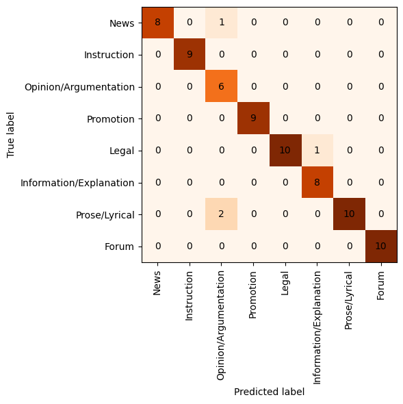
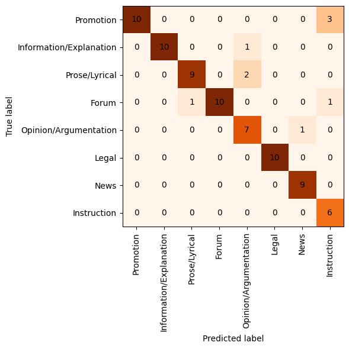
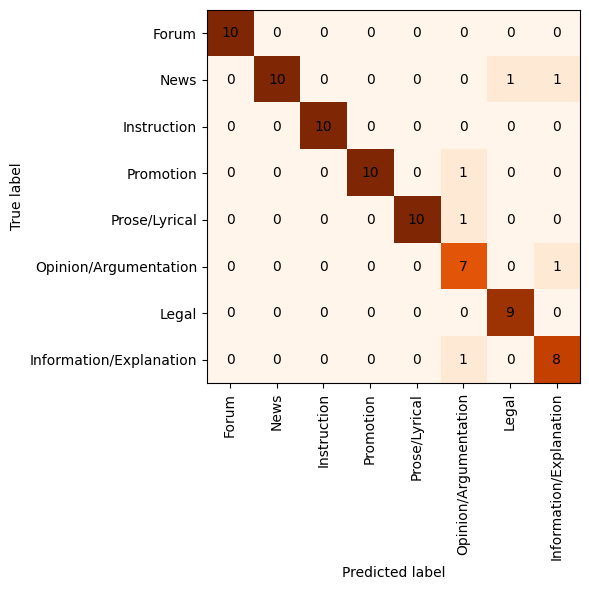
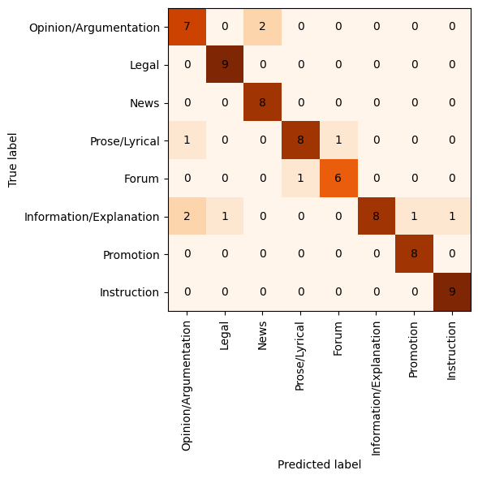
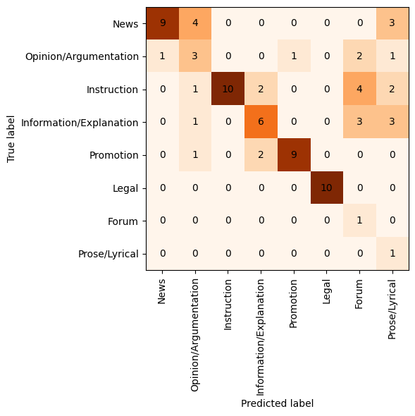

# Analysis of genre prediction in CLASSLA-web corpora

## Automatically annotated MaCoCu corpora

For automatic annotation, we only annotate texts that are longer (or the same size) than 75 words. Furthermore, due to model's limitations, we only take the first 512 words of each text (because the max_sequence_length that model can take is 512 tokens).

See the [spreadsheet CLASSLA genres](https://docs.google.com/spreadsheets/d/1-jZW_lEAyCdI-tcywjUJUgBgu46jr2el1AgFOGYUxyU/edit?usp=sharing) for all sizes and genre distributions. 

We use the code `1-select_for_xgenre.py` and `2-predict_extended.py` in `/cache/tajak/macocu-mt` (kt-gpu2) (see the README.md file in this directory). The automatically annotated datasets are saved in `/cache/tajak/macocu-mt/datasets/annotated`.

## Sample evaluation

The manually annotated samples are:
- *annotations/sample-evaluation-annotation-run1.tsv* and *annotations/manual-genre-evaluation-run2.tsv* - done on Slovenian, Croatian, Macedonian and Albanian
- */cache/tajak/macocu-mt/datasets/manually-evaluated/MaCoCu-mt-genre-sample-evaluated.jsonl* - Maltese

Code for evaluation of results: `evaluation-of-annotation.ipynb`

### Results

| Dataset        | Macro F1 | Micro F1 |
|----------------|----------|----------|
| CLASSLA.web-sl | 0.943     | 0.946     |
| CLASSLA.web-hr | 0.888     | 0.892     |
| CLASSLA.web-mk | 0.932     | 0.932     |
| MaCoCu-sq | 0.865     | 0.863     |
| MaCoCu-mt | 0.555     | 0.615     |
| MaCoCu-mt (dummy: most-frequent) | 0.040     | 0.192     |
| MaCoCu-mt (dummy: stratified) | 0.105     | 0.131     |

The top three labels with the lowest F1 score (in each dataset) are marked with bold.

### CLASSLA.web-sl

Macro f1: 0.943, Micro f1: 0.946, Accuracy: 0.946

|                         |   precision |   recall |   f1-score |   support |
|:------------------------|------------:|---------:|-----------:|----------:|
| Forum                   |    1        | 1        |   1        | 10        |
| **Information/Explanation** |    0.888889 | 1        |   0.941176 |  8        |
| Instruction             |    1        | 1        |   1        |  9        |
| Legal                   |    1        | 0.909091 |   0.952381 | 11        |
| **News**                    |    1        | 0.888889 |   0.941176 |  9        |
| **Opinion/Argumentation**   |    0.666667 | 1        |   0.8      |  6        |
| Promotion               |    1        | 1        |   1        |  9        |
| **Prose/Lyrical**           |    1        | 0.833333 |   0.909091 | 12        |

### Corpus: CLASSLA.web-hr

Macro f1: 0.888, Micro f1: 0.892, Accuracy: 0.892

|                         |   precision |   recall |   f1-score |   support |
|:------------------------|------------:|---------:|-----------:|----------:|
| Forum                   |    1        | 0.833333 |   0.909091 | 12        |
| Information/Explanation |    1        | 0.888889 |   0.941176 |  9        |
| **Instruction**             |    0.625    | 1        |   0.769231 |  5        |
| Legal                   |    1        | 1        |   1        |  9        |
| News                    |    0.9      | 1        |   0.947368 |  9        |
| **Opinion/Argumentation**   |    0.7      | 0.875    |   0.777778 |  8        |
| Promotion               |    1        | 0.818182 |   0.9      | 11        |
| **Prose/Lyrical**           |    0.9      | 0.818182 |   0.857143 | 11        |

### Corpus: CLASSLA.web-mk

Macro f1: 0.932, Micro f1: 0.933, Accuracy: 0.933

|                         |   precision |   recall |   f1-score |   support |
|:------------------------|------------:|---------:|-----------:|----------:|
| Forum                   |    1        | 1        |   1        |  9        |
| **Information/Explanation** |    0.8      | 1        |   0.888889 |  8        |
| Instruction             |    1        | 1        |   1        |  9        |
| Legal                   |    0.9      | 1        |   0.947368 |  9        |
| **News**                    |    1        | 0.818182 |   0.9      | 11        |
| **Opinion/Argumentation**   |    0.777778 | 0.875    |   0.823529 |  8        |
| Promotion               |    1        | 0.9      |   0.947368 | 10        |
| Prose/Lyrical           |    1        | 0.909091 |   0.952381 | 11        |

### Corpus: MaCoCu-sq

Macro f1: 0.865, Micro f1: 0.863, Accuracy: 0.863

|                         |   precision |   recall |   f1-score |   support |
|:------------------------|------------:|---------:|-----------:|----------:|
| **Forum**                   |    0.857143 | 0.857143 |   0.857143 |  7        |
| **Information/Explanation** |    1        | 0.615385 |   0.761905 | 13        |
| Instruction             |    0.9      | 1        |   0.947368 |  9        |
| Legal                   |    0.9      | 1        |   0.947368 |  9        |
| News                    |    0.8      | 1        |   0.888889 |  8        |
| **Opinion/Argumentation**   |    0.7      | 0.777778 |   0.736842 |  9        |
| Promotion               |    0.888889 | 1        |   0.941176 |  8        |
| Prose/Lyrical           |    0.888889 | 0.8      |   0.842105 | 10        |

### Corpus: MaCoCu-mt

Macro f1: 0.555, Micro f1: 0.615, Accuracy: 0.615

|                         |   precision |   recall |   f1-score |   support |
|:------------------------|------------:|---------:|-----------:|----------:|
| **Forum**                   |    0.1      | 1        |   0.181818 |  1        |
| Information/Explanation |    0.6      | 0.461538 |   0.521739 | 13        |
| Instruction             |    1        | 0.5      |   0.666667 | 18        |
| Legal                   |    1        | 1        |   1        | 10        |
| News                    |    0.9      | 0.6      |   0.72     | 15        |
| **Opinion/Argumentation**   |    0.3      | 0.375    |   0.333333 |  8        |
| Promotion               |    0.9      | 0.75     |   0.818182 | 12        |
| **Prose/Lyrical**           |    0.111111 | 1        |   0.2      |  1        |

## More information on sample evaluation

### First batch of languages: Slovenian, Croatian, Macedonian and Albanian

For the sample, I randomly sampled 10 instances of each of the genre classes from the first 100.000 texts in the corpora -> 90 instances per corpus. I included "Other" as the label in the sample. However, as this label is mostly used so that the classifier can use it for harder examples, when doing manual annotation, I tried to identify the actual label of these texts, so most of texts, labelled Other, were manually annotated as something else.

I evaluated three corpora: CLASSLA-web.sl, CLASSLA-web.hr and CLASSLA-web.mk. After the two rounds of evaluation of these three corpora, I also evaluated the Albanian corpus: MaCoCu-sq.

### Second batch: extended evaluation to all other MaCoCu corpora

The sample was prepared in the same way, except for the fact that we randomly sampled the texts from the entire corpus (not from the first 100.000 as in the first batch). Second difference is that we did not include the "Other" label in the sample, because this is used as a "throw-away" category to be used when the classifier doesn't recognize the text to be of any other, more concrete genres.

### Label distribution (y_true)

Corpus: mk

| y_true_run2             |   count |
|:------------------------|--------:|
| Promotion               |      12 |
| News                    |      11 |
| Prose/Lyrical           |      11 |
| Opinion/Argumentation   |      11 |
| Information/Explanation |      10 |
| Forum                   |       9 |
| Instruction             |       9 |
| Legal                   |       9 |
| Multiple texts  (8%)        |       7 |
| Other                   |       1 |

Corpus: hr

| y_true_run2             |   count |
|:------------------------|--------:|
| Promotion               |      14 |
| Prose/Lyrical           |      12 |
| Forum                   |      12 |
| Information/Explanation |       9 |
| Legal                   |       9 |
| News                    |       9 |
| Opinion/Argumentation   |       8 |
| Multiple texts (7%)         |       6 |
| Other                   |       6 |
| Instruction             |       5 |

Corpus: sl

| y_true_run2             |   count |
|:------------------------|--------:|
| Prose/Lyrical           |      13 |
| Promotion               |      12 |
| Legal                   |      11 |
| Forum                   |      10 |
| News                    |       9 |
| Instruction             |       9 |
| Information/Explanation |       9 |
| Multiple texts (8%)         |       7 |
| Opinion/Argumentation   |       7 |
| Other                   |       3 |

Corpus: sq

| y_true                  |   count |
|:------------------------|--------:|
| Information/Explanation |      15 |
| Opinion/Argumentation   |      11 |
| Prose/Lyrical           |      11 |
| Forum                   |      10 |
| Legal                   |       9 |
| Instruction             |       9 |
| News                    |       8 |
| Promotion               |       8 |
| Other                   |       4 |
| Multiple texts  (3%)        |       3 |
| Incomprehensible (2%)       |       2 |

Corpus: mt

| y_true                  |   count |
|:------------------------|--------:|
| Instruction             |      18 |
| News                    |      15 |
| Information/Explanation |      13 |
| Promotion               |      12 |
| Legal                   |      10 |
| Opinion/Argumentation   |       8 |
| Multiple texts  (0.025%)        |       2 |
| Forum                   |       1 |
| Prose/Lyrical           |       1 |

Number of texts, annotated as problematic ("multiple texts") - mostly, they were not a coherent text (just a list of summaries, multiple texts concatenated):
- Slovenian, Croatian, Macedonian: 7-8%
- Albanian, Maltese: 3% - there were less problematic texts. However, in Albanian sample, there were also some incomprehensible texts - probably due to bad machine translation - 2% of texts.

### Comparing y_true and y_pred with F1 scores

For calculating the metrics of classifier's performance, I remove "Other" texts and "Multiple texts" (also "Incomprehensible" in case of Albanian) texts from the sample. Thus, we compare only the predictions of 8 labels.

Frequency of predicted labels after removal of "Other" and "Problematic" texts:

Corpus: mk

| y_pred                  |   count |
|:------------------------|--------:|
| Prose/Lyrical           |      10 |
| Information/Explanation |      10 |
| Legal                   |      10 |
| Forum                   |       9 |
| News                    |       9 |
| Instruction             |       9 |
| Promotion               |       9 |
| Opinion/Argumentation   |       9 |

Corpus: hr

| y_pred                  |   count |
|:------------------------|--------:|
| Opinion/Argumentation   |      10 |
| Forum                   |      10 |
| Prose/Lyrical           |      10 |
| News                    |      10 |
| Promotion               |       9 |
| Legal                   |       9 |
| Information/Explanation |       8 |
| Instruction             |       8 |

Corpus: sl

| y_pred                  |   count |
|:------------------------|--------:|
| Legal                   |      10 |
| Prose/Lyrical           |      10 |
| Forum                   |      10 |
| Opinion/Argumentation   |       9 |
| Instruction             |       9 |
| Promotion               |       9 |
| Information/Explanation |       9 |
| News                    |       8 |

Corpus: sq

| y_pred                  |   count |
|:------------------------|--------:|
| Opinion/Argumentation   |      10 |
| Legal                   |      10 |
| News                    |      10 |
| Instruction             |      10 |
| Prose/Lyrical           |       9 |
| Promotion               |       9 |
| Information/Explanation |       8 |
| Forum                   |       7 |

Corpus: mt

| y_pred                  |   count |
|:------------------------|--------:|
| News                    |      10 |
| Forum                   |      10 |
| Information/Explanation |      10 |
| Opinion/Argumentation   |      10 |
| Legal                   |      10 |
| Promotion               |      10 |
| Prose/Lyrical           |       9 |
| Instruction             |       9 |

### Improved sample evaluation - comparison with the first run

I re-did the evaluation on the same dataset, but after some improvements: the text was clearly separated into paragraphs -> texts are much more comprehensible and easier to understand; I used the doccano annotation platform -> easier and (slightly) faster annotation.

When I compared my annotations from the two runs, there were disagreements between the labels in 40 instances - 15% of instances.

The reasons for the differences:

| reason | frequency (# instances) |
|---|---|
| improved second run (text annotated with a label, instead of "problematic") | 8 |
| detected "multiple texts" that I didn't in the first run | 9 |
| inter-annotator disagreement | 23 |

So we can see that the improved methodology (better shown texts, using doccano and paragraph structure) improved annotation of 17 cases - 6% of all texts (either we were able to annotate texts that were previously incomprehensible, or we detected problematic texts that we previously didn't due to the lacking text structure).

In 23 instances (9%), there was inter-annotator disagreement, which shows the level of difficulty of this task. However, 8 of these cases appeared when annotating texts that were predicted as "Other", which we decided that we won't include in the annotation campaign anyway. If we disregard these cases, disagreement happened in 15 instances - 6% of texts.