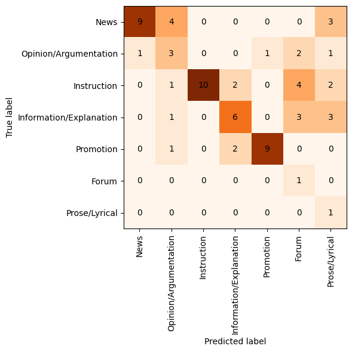
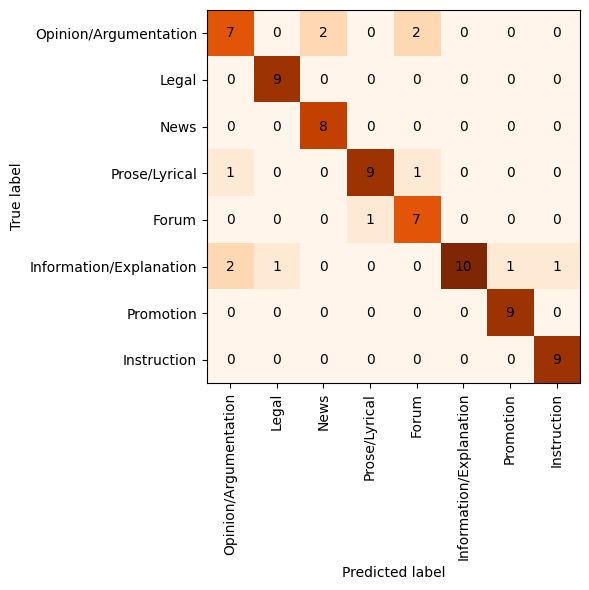

# Analysis of genre prediction in CLASSLA-web and MaCoCu corpora

Final test corpus which consists of all manually evaluated corpora is: `manual-annotations/multilingual-genre-annotated-test-set.json`

It is a JSON file with the following languages as keys. Each language item then consists of the following values:
    - accuracy, micro_f1, macro_f1: the evaluation results in accuracy, micro F1 and macro F1 metric
    - label_scores: per label F1 scores
    - dataset: the test dataset. The dataset can be opened as a pandas dataframe: `pd.DataFrame(json_dict["lang"]["dataset"])`. It includes:
        - the automatically predicted labels (y_pred),
        - the manually-evaluated labels (y_true),
        - text,
        - translation (the translation to English which was used for manual evaluation),
        - text_id (the same as in the original MaCoCu or CLASSLA-web corpora)
        - metadata
        - list of tokens (tokens) and their token ids (token_ids)
    - token_overlap: includes the following keys:
        - overlap_percentage: percentage of overlap with the train dataset (X-GENRE-train)
        - token_list: list of all tokens from the dataset
        - overlap_token_list: list of all tokens that appear both in train dataset and test set
        - label_level_token_lists: list of all tokens from the dataset for each of the labels

## Automatically annotated MaCoCu corpora

For automatic annotation, we only annotate texts that are longer (or the same size) than 75 words. Furthermore, due to model's limitations, we only take the first 512 words of each text (because the max_sequence_length that model can take is 512 tokens).

See the [spreadsheet CLASSLA genres](https://docs.google.com/spreadsheets/d/1-jZW_lEAyCdI-tcywjUJUgBgu46jr2el1AgFOGYUxyU/edit?usp=sharing) for all sizes and genre distributions. 

We use the code `1-select_for_xgenre.py` and `2-predict_extended.py` in `/cache/tajak/macocu-mt/`. The automatically annotated datasets are saved in `/cache/tajak/macocu-mt/datasets/annotated`.

See the code in `copied-code-from-cache` and the [README.md](copied-code-from-cache/README.md) file in the same folder for all documentation on how the corpora were annotated and samples were prepared. After annotation the following steps were done:
- Evaluate the sample after annotation: `/home/tajak/Crosslingual-Genre-Bias-Analysis/evaluation-of-annotation.ipynb`
- If needed, annotate additional instances: see section `Add additional instances to the sample to achieve 10 instances per label` in `/cache/tajak/macocu-mt/analyze-entire-file-prepare-sample.ipynb` to prepare additional instances; and section `Add additionally annotated instances` in `/home/tajak/Crosslingual-Genre-Bias-Analysis/evaluation-of-annotation.ipynb` to merge them with initial sample and get final evaluations.

Output:
- `manual-annotations/MaCoCu-{lang}-genre-sample-evaluated-complete-sample.jsonl` - manually evaluated samples (or `MaCoCu-{lang}-genre-sample-evaluated-complete-sample-run2.jsonl` in case there were two rounds of adding additional instances)- initial samples + additional instances (so that each label was evaluated on 10 instances); Multiple texts and Other texts are marked, but included in the sample - use the code in `/home/tajak/Crosslingual-Genre-Bias-Analysis/evaluation-of-annotation.ipynb` to discard them and evaluate them.

### Genre sample preparation

The genre samples are prepared in such way that we take 10 random instances of each genre from the entire corpus. We do not include the genres "Other" and "Mix", as they are not informative - the final sample size is 80 instances. If the manual evalutation shows that some instances had to be discarded, because they were "Multiple texts", "Incomprehensible" or would belong to the category "Other", we annotated additional instances so that each label was annotated on 10 instances.

Then we translate the source text in the sample to English using Google Translate. Google Translate provides models for all of our languages, except for Montenegrin, for which we used the Serbian MT model.

## Analyze the results

### Results

| Dataset        | Macro F1 | Micro F1 |
|----------------|----------|----------|
| MaCoCu-uk | 0.948     | 0.950     |
| CLASSLA.web-sl | 0.936     | 0.938     |
| CLASSLA.web-mk | 0.932     | 0.925     |
| MaCoCu-tr |  0.899    |  0.9    |
| CLASSLA.web-hr | 0.883     | 0.887     |
| MaCoCu-sq | 0.854    | 0.850     |
| MaCoCu-el |   0.844   |   0.850   |
| MaCoCu-ca | 0.827     | 0.825     |
| MaCoCu-is | 0.795     | 0.8     |
| MaCoCu-mt | 0.488     | 0.557     |

|                         |     mt |   el |   tr |   sq |   is |   uk |   ca |   mk |   hr |   sl |   average |   average-wth-mt |
|:------------------------|-------:|-----:|-----:|-----:|-----:|-----:|-----:|-----:|-----:|-----:|----------:|-----------------:|
| News                    |   0.69 | 0.9  | 0.95 | 0.89 | 0.73 | 1    | 0.82 | 0.91 | 0.95 | 0.9  |      0.87 |             0.89 |
| Opinion/Argumentation   |   0.33 | 0.87 | 0.82 | 0.67 | 0.82 | 0.91 | 0.84 | 0.78 | 0.78 | 0.82 |      0.76 |             0.81 |
| Instruction             |   0.69 | 0.71 | 0.9  | 0.95 | 0.78 | 0.95 | 0.75 | 1    | 0.75 | 1    |      0.85 |             0.86 |
| Information/Explanation |   0.52 | 0.7  | 0.82 | 0.8  | 0.5  | 1    | 0.72 | 0.84 | 0.95 | 0.9  |      0.78 |             0.8  |
| Promotion               |   0.82 | 0.62 | 0.86 | 0.95 | 0.75 | 0.78 | 0.78 | 0.95 | 0.87 | 1    |      0.84 |             0.84 |
| Forum                   |   0.18 | 0.95 | 0.89 | 0.78 | 0.95 | 0.95 | 0.84 | 1    | 0.91 | 1    |      0.84 |             0.91 |
| Prose/Lyrical           |   0.18 | 1    | 0.95 | 0.86 | 1    | 1    | 0.91 | 0.95 | 0.86 | 0.91 |      0.86 |             0.93 |
| Legal                   | nan    | 1    | 1    | 0.95 | 0.84 | 1    | 0.95 | 0.95 | 1    | 0.95 |      0.96 |             0.96 |
| Macro F1                |   0.49 | 0.84 | 0.9  | 0.85 | 0.8  | 0.95 | 0.83 | 0.92 | 0.88 | 0.94 |      0.84 |             0.87 |

### CLASSLA.web-sl

Macro f1: 0.936, Micro f1: 0.938, Accuracy: 0.938

|                         |   precision |   recall |   f1-score |   support |
|:------------------------|------------:|---------:|-----------:|----------:|
| Forum                   |     1       | 1        |   1        |   10      |
| Information/Explanation |     0.9     | 0.9      |   0.9      |   10      |
| Instruction             |     1       | 1        |   1        |   10      |
| Legal                   |     1       | 0.909091 |   0.952381 |   11      |
| News                    |     0.9     | 0.9      |   0.9      |   10      |
| Opinion/Argumentation   |     0.7     | 1        |   0.823529 |    7      |
| Promotion               |     1       | 1        |   1        |   10      |
| Prose/Lyrical           |     1       | 0.833333 |   0.909091 |   12      |

### CLASSLA.web-hr

Macro f1: 0.883, Micro f1: 0.887, Accuracy: 0.887

|                         |   precision |   recall |   f1-score |   support |
|:------------------------|------------:|---------:|-----------:|----------:|
| Forum                   |      1      | 0.833333 |   0.909091 |   12      |
| Information/Explanation |      1      | 0.909091 |   0.952381 |   11      |
| Instruction             |      0.6    | 1        |   0.75     |    6      |
| Legal                   |      1      | 1        |   1        |   10      |
| News                    |      0.9    | 1        |   0.947368 |    9      |
| Opinion/Argumentation   |      0.7    | 0.875    |   0.777778 |    8      |
| Promotion               |      1      | 0.769231 |   0.869565 |   13      |
| Prose/Lyrical           |      0.9    | 0.818182 |   0.857143 |   11      |

### Corpus: CLASSLA.web-mk

Macro f1: 0.923, Micro f1: 0.925, Accuracy: 0.925

|                         |   precision |   recall |   f1-score |   support |
|:------------------------|------------:|---------:|-----------:|----------:|
| Forum                   |     1       | 1        |   1        |    10     |
| Information/Explanation |     0.8     | 0.888889 |   0.842105 |     9     |
| Instruction             |     1       | 1        |   1        |    10     |
| Legal                   |     0.9     | 1        |   0.947368 |     9     |
| News                    |     1       | 0.833333 |   0.909091 |    12     |
| Opinion/Argumentation   |     0.7     | 0.875    |   0.777778 |     8     |
| Promotion               |     1       | 0.909091 |   0.952381 |    11     |
| Prose/Lyrical           |     1       | 0.909091 |   0.952381 |    11     |

### Corpus: MaCoCu-mt

Macro f1: 0.488, Micro f1: 0.557 Accuracy: 0.557

|                         |   precision |   recall |   f1-score |   support |
|:------------------------|------------:|---------:|-----------:|----------:|
| Forum                   |    0.1      | 1        |   0.181818 |  1        |
| Information/Explanation |    0.6      | 0.461538 |   0.521739 | 13        |
| Instruction             |    1        | 0.526316 |   0.689655 | 19        |
| News                    |    0.9      | 0.5625   |   0.692308 | 16        |
| Opinion/Argumentation   |    0.3      | 0.375    |   0.333333 |  8        |
| Promotion               |    0.9      | 0.75     |   0.818182 | 12        |
| Prose/Lyrical           |    0.1      | 1        |   0.181818 |  1        |

### MaCoCu-sq

Macro f1: 0.854, Micro f1: 0.85 Accuracy: 0.85

|                         |   precision |   recall |   f1-score |   support |
|:------------------------|------------:|---------:|-----------:|----------:|
| Forum                   |     0.7     | 0.875    |   0.777778 |      8    |
| Information/Explanation |     1       | 0.666667 |   0.8      |     15    |
| Instruction             |     0.9     | 1        |   0.947368 |      9    |
| Legal                   |     0.9     | 1        |   0.947368 |      9    |
| News                    |     0.8     | 1        |   0.888889 |      8    |
| Opinion/Argumentation   |     0.7     | 0.636364 |   0.666667 |     11    |
| Promotion               |     0.9     | 1        |   0.947368 |      9    |
| Prose/Lyrical           |     0.9     | 0.818182 |   0.857143 |     11    |

### MaCoCu-is

Macro f1: 0.795, Micro f1: 0.8 Accuracy: 0.8

|                         |   precision |   recall |   f1-score |   support |
|:------------------------|------------:|---------:|-----------:|----------:|
| Forum                   |     0.9     | 1        |   0.947368 |       9   |
| Information/Explanation |     0.4     | 0.666667 |   0.5      |       6   |
| Instruction             |     0.7     | 0.875    |   0.777778 |       8   |
| Legal                   |     0.8     | 0.888889 |   0.842105 |       9   |
| News                    |     0.8     | 0.666667 |   0.727273 |      12   |
| Opinion/Argumentation   |     0.9     | 0.75     |   0.818182 |      12   |
| Promotion               |     0.9     | 0.642857 |   0.75     |      14   |
| Prose/Lyrical           |     1       | 1        |   1        |      10   |

### MaCoCu-el

Macro f1: 0.844, Micro f1: 0.85, Accuracy: 0.85

|                         |   precision |   recall |   f1-score |   support |
|:------------------------|------------:|---------:|-----------:|----------:|
| Forum                   |      1      | 0.909091 |   0.952381 |     11    |
| Information/Explanation |      0.8    | 0.615385 |   0.695652 |     13    |
| Instruction             |      0.6    | 0.857143 |   0.705882 |      7    |
| Legal                   |      1      | 1        |   1        |     10    |
| News                    |      0.9    | 0.9      |   0.9      |     10    |
| Opinion/Argumentation   |      1      | 0.769231 |   0.869565 |     13    |
| Promotion               |      0.5    | 0.833333 |   0.625    |      6    |
| Prose/Lyrical           |      1      | 1        |   1        |     10    |

### MaCoCu-ca

Macro f1: 0.827, Micro f1: 0.825 Accuracy: 0.825

|                         |   precision |   recall |   f1-score |   support |
|:------------------------|------------:|---------:|-----------:|----------:|
| Forum                   |      0.8    | 0.888889 |   0.842105 |     9     |
| Information/Explanation |      0.9    | 0.6      |   0.72     |    15     |
| Instruction             |      0.6    | 1        |   0.75     |     6     |
| Legal                   |      0.9    | 1        |   0.947368 |     9     |
| News                    |      0.7    | 1        |   0.823529 |     7     |
| Opinion/Argumentation   |      0.8    | 0.888889 |   0.842105 |     9     |
| Promotion               |      0.9    | 0.692308 |   0.782609 |    13     |
| Prose/Lyrical           |      1      | 0.833333 |   0.909091 |    12     |

### MaCoCu-tr

Macro f1: 0.899, Micro f1: 0.9 Accuracy: 0.9

|                         |   precision |   recall |   f1-score |   support |
|:------------------------|------------:|---------:|-----------:|----------:|
| Forum                   |      0.8    | 1        |   0.888889 |       8   |
| Information/Explanation |      0.7    | 1        |   0.823529 |       7   |
| Instruction             |      0.9    | 0.9      |   0.9      |      10   |
| Legal                   |      1      | 1        |   1        |      10   |
| News                    |      1      | 0.909091 |   0.952381 |      11   |
| Opinion/Argumentation   |      0.9    | 0.75     |   0.818182 |      12   |
| Promotion               |      0.9    | 0.818182 |   0.857143 |      11   |
| Prose/Lyrical           |      1      | 0.909091 |   0.952381 |      11   |

### MaCoCu-uk

Macro f1: 0.948, Micro f1: 0.95 Accuracy: 0.95

|                         |   precision |   recall |   f1-score |   support |
|:------------------------|------------:|---------:|-----------:|----------:|
| Forum                   |     0.9     | 1        |   0.947368 |      9    |
| Information/Explanation |     1       | 1        |   1        |     10    |
| Instruction             |     1       | 0.909091 |   0.952381 |     11    |
| Legal                   |     1       | 1        |   1        |     10    |
| News                    |     1       | 1        |   1        |     10    |
| Opinion/Argumentation   |     1       | 0.833333 |   0.909091 |     12    |
| Promotion               |     0.7     | 0.875    |   0.777778 |      8    |
| Prose/Lyrical           |     1       | 1        |   1        |     10    |

## More information on sample evaluation

### First batch of languages: Slovenian, Croatian, Macedonian and Albanian

For the sample, I randomly sampled 10 instances of each of the genre classes from the first 100.000 texts in the corpora -> 90 instances per corpus. I included "Other" as the label in the sample. However, as this label is mostly used so that the classifier can use it for harder examples, when doing manual annotation, I tried to identify the actual label of these texts, so most of texts, labelled Other, were manually annotated as something else.

I evaluated three corpora: CLASSLA-web.sl, CLASSLA-web.hr and CLASSLA-web.mk. After the two rounds of evaluation of these three corpora, I also evaluated the Albanian corpus: MaCoCu-sq.

### Second batch: extended evaluation to all other MaCoCu corpora

The sample was prepared in the same way, except for the fact that we randomly sampled the texts from the entire corpus (not from the first 100.000 as in the first batch). Second difference is that we did not include the "Other" label in the sample, because this is used as a "throw-away" category to be used when the classifier doesn't recognize the text to be of any other, more concrete genres.

### Label distribution (y_true)

This is the distribution after the additionally evaluated instances were added.

For calculating the metrics of classifier's performance, I remove "Other" texts and "Multiple texts" (also "Incomprehensible" in case of Albanian) texts from the sample. Thus, we compare only the predictions of 8 labels, each having 10 instances.

Initial distribution (before post-processing) - OLD RESULTS (before cleaning non-target languages):

MaCoCu-mt:

| y_true                  |   count |
|:------------------------|--------:|
| Instruction             |      19 |
| News                    |      16 |
| Information/Explanation |      13 |
| Promotion               |      12 |
| Legal                   |      10 |
| Opinion/Argumentation   |       8 |
| Multiple texts (3%)         |       2 |
| Forum                   |       1 |
| Prose/Lyrical           |       1 |

MaCoCu-el:

| y_true                  |   count |
|:------------------------|--------:|
| Opinion/Argumentation   |      13 |
| Information/Explanation |      13 |
| Forum                   |      11 |
| Prose/Lyrical           |      10 |
| Legal                   |      10 |
| News                    |      10 |
| Instruction             |       7 |
| Promotion               |       6 |
| Multiple texts (7%)         |       6 |

MaCoCu-tr:

| y_true                  |   count |
|:------------------------|--------:|
| Opinion/Argumentation   |      12 |
| News                    |      11 |
| Prose/Lyrical           |      11 |
| Promotion               |      11 |
| Instruction             |      10 |
| Legal                   |      10 |
| Forum                   |       8 |
| Information/Explanation |       7 |
| Multiple texts (4.7%)         |       4 |
| Other  (1.17%)                 |       1 |

MaCoCu-sq:

| y_true                  |   count |
|:------------------------|--------:|
| Information/Explanation |      17 |
| Opinion/Argumentation   |      12 |
| Forum                   |      12 |
| Prose/Lyrical           |      12 |
| Legal                   |       9 |
| Promotion               |       9 |
| Instruction             |       9 |
| News                    |       8 |
| Other (4.12%)                  |       4 |
| Multiple texts (3.1%)         |       3 |
| Incomprehensible (2.1%)       |       2 |

MaCoCu-is:

| y_true                  |   count |
|:------------------------|--------:|
| Promotion               |      13 |
| Opinion/Argumentation   |      12 |
| News                    |      12 |
| Prose/Lyrical           |      10 |
| Legal                   |       9 |
| Forum                   |       9 |
| Instruction             |       8 |
| Information/Explanation |       7 |
| Multiple texts (7.95%)         |       7 |
| Incomprehensible (1.14%)       |       1 |

MaCoCu-ca:

| y_true                  |   count |
|:------------------------|--------:|
| Information/Explanation |      15 |
| Promotion               |      13 |
| Prose/Lyrical           |      12 |
| Forum                   |       9 |
| Legal                   |       9 |
| Opinion/Argumentation   |       9 |
| News                    |       7 |
| Instruction             |       6 |
| Multiple texts (3.5%)         |       3 |
| Incomprehensible (2.35%)       |       2 |

MaCoCu-uk:

| y_true                  |   count |
|:------------------------|--------:|
| Opinion/Argumentation   |      12 |
| Instruction             |      11 |
| Prose/Lyrical           |      10 |
| Legal                   |      10 |
| News                    |      10 |
| Information/Explanation |      10 |
| Forum                   |       9 |
| Promotion               |       8 |
| Multiple texts  (9%)        |       8 |

In CLASSLA-web corpora, we initially also annotated the "Other" labels, that is why they are present here more than in other corpora.

CLASSLA-mk:

| y_true                  |   count |
|:------------------------|--------:|
| Promotion               |      13 |
| News                    |      12 |
| Prose/Lyrical           |      11 |
| Opinion/Argumentation   |      11 |
| Information/Explanation |      11 |
| Forum                   |      10 |
| Instruction             |      10 |
| Legal                   |       9 |
| Multiple texts  (8.3%)        |       8 |
| Other   (1%)                |       1 |

CLASSLA-hr:

| y_true                  |   count |
|:------------------------|--------:|
| Promotion               |      16 |
| Prose/Lyrical           |      12 |
| Forum                   |      12 |
| Information/Explanation |      11 |
| Legal                   |      10 |
| News                    |       9 |
| Opinion/Argumentation   |       8 |
| Multiple texts (7.2%)         |       7 |
| Other (6.19%)                  |       6 |
| Instruction             |       6 |

| y_true                  |   count |
|:------------------------|--------:|
| Promotion               |      13 |
| Prose/Lyrical           |      13 |
| Legal                   |      11 |
| Information/Explanation |      11 |
| News                    |      10 |
| Instruction             |      10 |
| Forum                   |      10 |
| Multiple texts (8.25%)         |       8 |
| Opinion/Argumentation   |       8 |
| Other   (3.1%)                |       3 |

Number of texts, annotated as problematic ("multiple texts") - mostly, they were not a coherent text (just a list of summaries, multiple texts concatenated):
- Slovenian, Croatian, Macedonian, Icelandic, Greek, Ukrainian: 6-9%
- Albanian, Maltese, Turkish, Catalan: 3-5% - there were less problematic texts. However, in Albanian sample, there were also some incomprehensible texts - probably due to bad machine translation - 2% of texts.

### Improved sample evaluation - comparison with the first run

I re-did the evaluation on the same dataset, but after some improvements: the text was clearly separated into paragraphs -> texts are much more comprehensible and easier to understand; I used the doccano annotation platform -> easier and (slightly) faster annotation.

When I compared my annotations from the two runs, there were disagreements between the labels in 40 instances - 15% of instances.

The reasons for the differences:

| reason | frequency (# instances) |
|---|---|
| improved second run (text annotated with a label, instead of "problematic") | 8 |
| detected "multiple texts" that I didn't in the first run | 9 |
| inter-annotator disagreement | 23 |

So we can see that the improved methodology (better shown texts, using doccano and paragraph structure) improved annotation of 17 cases - 6% of all texts (either we were able to annotate texts that were previously incomprehensible, or we detected problematic texts that we previously didn't due to the lacking text structure).

In 23 instances (9%), there was inter-annotator disagreement, which shows the level of difficulty of this task. However, 8 of these cases appeared when annotating texts that were predicted as "Other", which we decided that we won't include in the annotation campaign anyway. If we disregard these cases, disagreement happened in 15 instances - 6% of texts.

|                            |   translation |   word order |   text structure |   50% words removal |
|:---------------------------|--------------:|-------------:|-----------------:|--------------------:|
| macro_F1                   |     -13.901   |    -16.6631  |        -13.8073  |           -12.9245  |
| Instruction_F1             |      -5.42588 |    -18.4241  |        -12.4052  |           -12.7722  |
| Forum_F1                   |     -25.9625  |    -14.5998  |        -12.9499  |           -12.8476  |
| Opinion/Argumentation_F1   |     -29.1342  |    -44.9631  |        -21.3713  |           -30.7817  |
| Prose/Lyrical_F1           |      -6.04474 |     -6.8505  |         -5.74713 |            -1.65945 |
| Legal_F1                   |      -7.58789 |     -9.84935 |        -16.2388  |           -13.0156  |
| Promotion_F1               |     -15.293   |     -7.5402  |         -9.06795 |            -9.39211 |
| News_F1                    |     -17.8899  |    -19.6108  |        -12.522   |           -14.2098  |
| Information/Explanation_F1 |      -4.72316 |    -14.3505  |        -21.6438  |           -10.4084  |